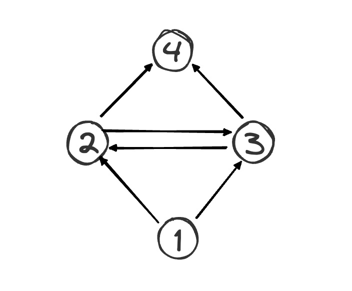

# 图结构的 DFS/BFS 遍历

前置知识

阅读本文前，你需要先学习：

- 图结构基础及通用代码实现
- 多叉树的递归/层序遍历

一句话总结

图的遍历就是 多叉树遍历 的延伸，主要遍历方式还是深度优先搜索（DFS）和广度优先搜索（BFS）。

唯一的区别是，树结构中不存在环，而图结构中可能存在环，所以我们需要标记遍历过的节点，避免遍历函数在环中死循环。

遍历图的「节点」和「路径」略有不同，遍历「节点」时，需要 `visited` 数组在前序位置标记节点；遍历图的所有「路径」时，需要 `onPath` 数组在前序位置标记节点，在后序位置撤销标记。

可视化面板 支持创建图结构，同时支持可视化 DFS/BFS 遍历的路径。**你可以直观地看到，图结构看起来虽然比树结构复杂，但图的遍历本质上还是树的遍历**。

先看 DFS 算法，你可以打开下面的可视化面板，多次点击 `console.log` 这行代码，即可看到 DFS 遍历图的过程，注意 `traverse` 函数的递归过程

下面我结合代码和可视化面板，具体解释上述总结。

## 深度优先搜索（DFS）

前文 图结构基础和通用实现 中说了，我们一般不用 `Vertex` 这样的类来存储图，但是这里我还是先用一下这个类，以便大家把图的遍历和多叉树的遍历做对比。后面我会给出基于邻接表/邻接矩阵的遍历代码。

### 遍历所有节点（`visited` 数组）

对比多叉树的遍历框架看图的遍历框架吧：

```python
# 多叉树节点
class Node:
    def __init__(self, val=0, children=None):
        self.val = val
        self.children = children if children is not None else []

# 多叉树的遍历框架
def traverse(root):
    # base case
    if root is None:
        return
    # 前序位置
    print(f"visit {root.val}")
    for child in root.children:
        traverse(child)
    # 后序位置

# 图节点
class Vertex:
    def __init__(self, id=0, neighbors=None):
        self.id = id
        self.neighbors = neighbors if neighbors is not None else []

# 图的遍历框架
# 需要一个 visited 数组记录被遍历过的节点
# 避免走回头路陷入死循环
def traverse_graph(s, visited):
    # base case
    if s is None:
        return
    if visited.get(s.id, False):
        # 防止死循环
        return
    # 前序位置
    visited[s.id] = True
    print(f"visit {s.id}")
    for neighbor in s.neighbors:
        traverse_graph(neighbor)
    # 后序位置
```

可以看到，图的遍历比多叉树的遍历多了一个 `visited` 数组，用来记录被遍历过的节点，避免遇到环时陷入死循环。

为什么成环会导致死循环

举个最简单的成环场景，有一条 `1 -> 2` 的边，同时有一条 `2 -> 1` 的边，节点 `1, 2` 就形成了一个环：


```python
1 <=> 2
```

如果我们不标记遍历过的节点，那么从 `1` 开始遍历，会走到 `2`，再走到 `1`，再走到 `2`，再走到 `1`，如此 `1->2->1->2->...` 无限递归循环下去。

如果有了 `visited` 数组，第一次遍历到 `1` 时，会标记 `1` 为已访问，出现 `1->2->1` 这种情况时，发现 `1` 已经被访问过，就会直接返回，从而终止递归，避免了死循环。

有了上面的铺垫，就可以写出基于邻接表/邻接矩阵的图遍历代码了。虽然邻接表/邻接矩阵的底层存储方式不同，但提供了统一的 API，所以直接使用 图结构基础和通用实现 中那个 `Graph` 接口的方法即可：


```python
# 遍历图的所有节点
def traverse(graph, s, visited):
    # base case
    if s < 0 or s >= len(graph):
        return
    if visited[s]:
        # 防止死循环
        return
    # 前序位置
    visited[s] = True
    print("visit", s)
    for e in graph.neighbors(s):
        traverse(graph, e.to, visited)
    # 后序位置
```

你可以打开下面的可视化面板，多次点击 `console.log` 这行代码，即可看到 DFS 遍历图的过程：


由于 `visited` 数组的剪枝作用，这个遍历函数会遍历一次图中的所有节点，并尝试遍历一次所有边，所以算法的时间复杂度是 O(E+V)*O*(*E*+*V*)，其中 `E` 是边的总数，`V` 是节点的总数。

时间复杂度为什么是 O(E+V)*O*(*E*+*V*)？

我们之前讲解 二叉树的遍历 时说，二叉树的遍历函数时间复杂度是 O(N)*O*(*N*)，其中 N*N* 是节点的总数。

这里图结构既然是树结构的延伸，为什么图的遍历函数时间复杂度是 O(E+V)*O*(*E*+*V*)，要把边的数量 E*E* 也算进去呢？为什么不是 O(V)*O*(*V*) 呢？

这是个非常好的问题。你可以花上两分钟想想，我把答案写在下面。


### 遍历所有路径（`onPath` 数组）

对于树结构，遍历所有「路径」和遍历所有「节点」是没什么区别的。而对于图结构，遍历所有「路径」和遍历所有「节点」稍有不同。

因为对于树结构来说，只能由父节点指向子节点，所以从根节点 `root` 出发，到任意一个节点 `targetNode` 的路径都是唯一的。换句话说，我遍历一遍树结构的所有节点之后，必然可以找到 `root` 到 `targetNode` 的唯一路径：

```python
# 多叉树的遍历框架，寻找从根节点到目标节点的路径
path = []

def traverse(root, targetNode):
    # base case
    if root is None:
        return
    
    # 前序位置
    path.append(root)
    if root.val == targetNode.val:
        print("find path:", path)
    
    for child in root.children:
        traverse(child, targetNode)
    
    # 后序位置
    path.pop()
```

而对于图结构来说，由起点 `src` 到目标节点 `dest` 的路径可能不止一条。我们需要一个 `onPath` 数组，在进入节点时（前序位置）标记为正在访问，退出节点时（后序位置）撤销标记，这样才能遍历图中的所有路径，从而找到 `src` 到 `dest` 的所有路径：


```python
# 下面的算法代码可以遍历图的所有路径，寻找从 src 到 dest 的所有路径

# onPath 和 path 记录当前递归路径上的节点
on_path = [False] * len(graph)
path = []

def traverse(graph, src, dest):
    # base case
    if src < 0 or src >= len(graph):
        return
    if on_path[src]:
        # 防止死循环（成环）
        return
    # 前序位置
    on_path[src] = True
    path.append(src)
    if src == dest:
        print(f"find path: {path}")
    for e in graph.neighbors(src):
        traverse(graph, e.to, dest)
    # 后序位置
    path.pop()
    on_path[src] = False
```


关键区别在于后序位置撤销标记

为啥之前讲的遍历节点就不用撤销 `visited` 数组的标记，而这里要在后序位置撤销 `onPath` 数组的标记呢？

因为前文遍历节点的代码中，`visited` 数组的职责是保证每个节点只会被访问一次。**而对于图结构来说，要想遍历所有路径，可能会多次访问同一个节点，这是关键的区别**。

比方说下面这幅图，我们想求从节点 `1` 到节点 `4` 的全部路径：



如果使用前文遍历节点的算法，只在前序位置标记 `visited` 为 true，那么遍历完 `1->2->4` 和 `1->2->3->4` 之后，所有节点都已经被标记为已访问了，算法就会停止，`visited` 数组完成了自己的职责。

但是显然我们还没有遍历完所有路径，`1->3->2->4` 和 `1->3->4` 被漏掉了。

如果用 `onPath` 数组在离开节点时（后序位置）撤销标记，就可以找到 `1` 到 `4` 的所有路径。

由于这里使用的 `onPath` 数组会在后序位置撤销标记，所以这个函数可能重复遍历图中的节点和边，复杂度一般较高（阶乘或指数级），具体的时间复杂应该是所有路径的长度之和，取决于图的结构特点。

### 同时使用 `visited` 和 `onPath` 数组

按照上面的分析，`visited` 数组和 `onPath` 分别用于遍历所有节点和遍历所有路径。那么它们两个是否可能会同时出现呢？答案是可能的。

遍历所有路径的算法复杂度较高，大部分情况下我们可能并不需要穷举完所有路径，而是仅需要找到某一条符合条件的路径。这种场景下，我们可能会借助 `visited` 数组进行剪枝，提前排除一些不符合条件的路径，从而降低复杂度。

比如后文 拓扑排序 中会讲到如何判定图是否成环，就会同时利用 `visited` 和 `onPath` 数组来进行剪枝。

比方说判定成环的场景，在遍历所有路径的过程中，如果发现一个节点 `s` 被标记为 `visited`，那么说明从 `s` 这个起点出发的所有路径在之前都已经遍历过了。如果之前遍历的时候都没有找到环，我现在再去遍历一次，肯定也不会找到环，所以这里可以直接剪枝，不再继续遍历节点 `s`。

我会在后面的图论算法和习题中结合具体的案例讲解，这里就不展开了。

### 完全不用 `visited` 和 `onPath` 数组

是否有既不用 `visited` 数组，也不用 `onPath` 数组的场景呢？其实也是有的。

前面介绍了，`visited` 和 `onPath` 主要的作用就是处理成环的情况，避免死循环。那如果题目告诉你输入的图结构不包含环，那么你就不需要考虑成环的情况了。

比如下面这个例题：


这个题目输入的是一个 邻接表，且明确告诉你输入的图结构不包含环，所以不需要 `visited` 和 `onPath` 数组，直接使用 DFS 遍历图就行了：

java 🟢cpp 🤖go 🤖javascript 🤖python 🤖


```python
class Solution:
    # 记录所有路径
    def __init__(self):
        self.res = []
        self.path = []

    def allPathsSourceTarget(self, graph: List[List[int]]) -> List[List[int]]:
        self.traverse(graph, 0)
        return self.res

    # 图的遍历框架
    def traverse(self, graph: List[List[int]], s: int):
        # 添加节点 s 到路径
        self.path.append(s)

        n = len(graph)
        if s == n - 1:
            # 到达终点
            self.res.append(self.path.copy())
            self.path.pop()
            return

        # 递归每个相邻节点
        for v in graph[s]:
            self.traverse(graph, v)

        # 从路径移出节点 s
        self.path.pop()
```

可视化面板 支持图结构的可视化，你可以多次点击 `if (s === n - 1)` 这一行代码，观看算法的遍历过程：


## 广度优先搜索（BFS）

图结构的广度优先搜索其实就是 多叉树的层序遍历，无非就是加了一个 `visited` 数组来避免重复遍历节点。

理论上 BFS 遍历也需要区分遍历所有「节点」和遍历所有「路径」，但是实际上 BFS 算法一般只用来寻找那条**最短路径**，不会用来求**所有路径**。

当然 BFS 算法肯定也可以求所有路径，但是我们一般会选择用 DFS 算法求所有路径，具体原因我在 二叉树的递归/层序遍历 中讲过，这里就不展开了。

那么如果只求最短路径的话，只需要遍历「节点」就可以了，因为按照 BFS 算法一层一层向四周扩散的逻辑，第一次遇到目标节点，必然就是最短路径。

和前文 多叉树层序遍历 介绍的一样，图结构的 BFS 算法框架也有三种不同的写法，下面我会对比着多叉树的层序遍历写一下图结构的三种 BFS 算法框架。

### 写法一

第一种写法是不记录遍历步数的：


```python
# 多叉树的层序遍历
def levelOrderTraverse(root):
    if root is None:
        return
    from collections import deque
    q = deque([root])
    while q:
        cur = q.popleft()
        # 访问 cur 节点
        print(cur.val)

        # 把 cur 的所有子节点加入队列
        for child in cur.children:
            q.append(child)

# 图结构的 BFS 遍历，从节点 s 开始进行 BFS
def bfs(graph, s):
    visited = [False] * len(graph)
    from collections import deque
    q = deque([s])
    visited[s] = True

    while q:
        cur = q.popleft()
        print(f"visit {cur}")
        for e in graph.neighbors(cur):
            if not visited[e.to]:
                q.append(e.to)
                visited[e.to] = True
```


### 写法二

第二种能够记录遍历步数的写法：


```python
from collections import deque

# 多叉树的层序遍历
def levelOrderTraverse(root):
    if root is None:
        return
    q = deque([root])
    # 记录当前遍历到的层数（根节点视为第 1 层）
    depth = 1
    
    while q:
        sz = len(q)
        for _ in range(sz):
            cur = q.popleft()
            # 访问 cur 节点，同时知道它所在的层数
            print(f"depth = {depth}, val = {cur.val}")
            
            for child in cur.children:
                q.append(child)
        depth += 1


# 从 s 开始 BFS 遍历图的所有节点，且记录遍历的步数
def bfs(graph, s):
    visited = [False] * len(graph)
    q = deque([s])
    visited[s] = True
    # 记录从 s 开始走到当前节点的步数
    step = 0
    
    while q:
        sz = len(q)
        for i in range(sz):
            cur = q.popleft()
            print(f"visit {cur} at step {step}")
            for e in graph.neighbors(cur):
                if not visited[e.to]:
                    q.append(e.to)
                    visited[e.to] = True
        step += 1
```

在这个可视化面板中，我对 `step` 不同的节点设置了不同的颜色：


这个 `step` 变量记录了从起点 `s` 开始的遍历步数，对于无权图来说，相当于每条边的权重都是 1，这个变量就可以辅助我们判断最短路径。

### 写法三

第三种能够适配不同权重边的写法：


```python
# 多叉树的层序遍历
# 每个节点自行维护 State 类，记录深度等信息
class State:
    def __init__(self, node, depth):
        self.node = node
        self.depth = depth

def levelOrderTraverse(root):
    if root is None:
        return
    from collections import deque
    q = deque([State(root, 1)])
    while q:
        state = q.popleft()
        cur = state.node
        depth = state.depth
        # 访问 cur 节点，同时知道它所在的层数
        print(f"depth = {depth}, val = {cur.val}")
        
        for child in cur.children:
            q.append(State(child, depth + 1))


# 图结构的 BFS 遍历，从节点 s 开始进行 BFS，且记录路径的权重和
# 每个节点自行维护 State 类，记录从 s 走来的权重和
class State:
    def __init__(self, node, weight):
        # 当前节点 ID
        self.node = node
        # 从起点 s 到当前节点的权重和
        self.weight = weight


def bfs(graph, s):
    visited = [False] * len(graph)
    from collections import deque

    q = deque([State(s, 0)])
    visited[s] = True

    while q:
        state = q.popleft()
        cur = state.node
        weight = state.weight
        print(f"visit {cur} with path weight {weight}")
        for e in graph.neighbors(cur):
            if not visited[e.to]:
                q.append(State(e.to, weight + e.weight))
                visited[e.to] = True
```

对于加权图，由于每条边的权重不同，遍历的步数不再能代表最短路径的长度，所以需要每个节点用自定义 `State` 类维护自己的路径权重和，最典型的例子就是 Dijkstra 单源最短路径算法 了。

在这个可视化面板中，我创建了一幅加权图。你可以多次点击 `console.log` 这一行代码，注意命令行的输出，这种写法可以在遍历节点的同时记录起点到当前节点的路径和，这是前两种 BFS 代码做不到的：