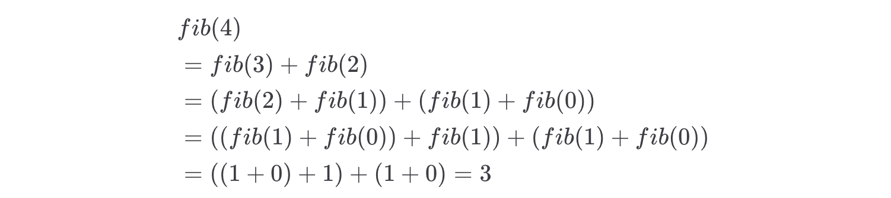

# 一个视角 + 两种思维模式搞定递归

阅读本文前，你需要先学习：

- 二叉树的递归/层序遍历

一句话总结

一个视角是指「树」的视角，两种思维模式是指「遍历」和「分解问题」两种思维模式。

**本文给你讲清楚：**

1、算法的本质是穷举，递归是一种重要的穷举手段，**==递归的正确理解方法是从「树」的角度理解。==**

2、==**编写递归算法，有两种思维模式：一种是通过「遍历」一遍树得到答案，另一种是通过「分解问题」得到答案。**==

本文的主要目的是借助 可视化面板 给你讲清楚正确的思维方法，而不会深入探讨代码细节。本站后面有专门的章节讲解各种递归算法以及习题，都遵循文本讲解的思维模式，有了本文的铺垫，学习起来将事半功倍。

## 从树的角度理解递归

对于初学者，递归算法确实不容易理解，我刚学算法时也不例外。

我曾设想过一些有趣的视角来理解递归，比如把两面镜子相对放置，镜子中的影像就会无限嵌套下去，这似乎也算是递归的一种体现？

再比如，从程序运行原理上来看，递归函数的调用本质上就是入栈和出栈的过程，所以应该可以从栈的角度理解递归？

随着我对算法的理解不断深入，现在我可以负责任地告诉你，理解和编写递归算法最有效的方法是从「树」的视角去理解，其他的都属于花拳绣腿，中看不中用。

下面我将用斐波那契树和全排列这两个简单的经典算法问题来论证这一点。

再次强调，本文的重点是思维方法而不是代码，所以不必太纠结代码细节。请结合可视化面板，重点理解「递归树」的抽象，以及「遍历」和「分解问题」这两种思维模式的区别。

### 斐波那契数列

首先来看一个既简单又经典的问题：斐波那契数列。

斐波那契数列的数学定义如下：


比方说：



那么现在请你写一个函数，输入一个整数 *n*，返回斐波那契数列 *fib*(*n*) 的值：

```python
int fib(int n);
```

其实直接把斐波那契数列的数学定义翻译成代码，就可以得到一个递归解法：

```python
int fib(int n) {
    if (n < 2) {
        return n;
    }
    return fib(n - 1) + fib(n - 2);
}
```

当然，这个解法的效率并不高，在 动态规划核心框架 中，我们会继续优化，这里暂且不优化，就看这个递归解法。

把这个解法放到可视化面板中，让我们来计算一下 `fib(5)`，请你按照我的步骤操作：

点开这个[可视化面版](https://labuladong.online/algo/essential-technique/understand-recursion/#div_mydata-fib)，多次点击左侧代码中的 `if (n < 2)` 这一行，即可看到这个 fib 函数就像是一个在二叉树上游走的指针，从根节点出发遍历完整棵树，最终回到根节点，也就计算出了 `fib(5)` 的值：

**理解可视化面板**

之所以点击 `if (n < 2)` 这一行，是因为这个条件是递归的 base case，每次递归调用都会执行这一行代码，所以点击跳转这一行代码就相当于进入一次新的递归调用，即进入递归树上的一个新节点。

注意看递归树的节点还有颜色的区别：

最开始的时候，根节点是粉色的，其他节点都是半透明的，因为算法开始时站在根节点上，其他递归节点还没有执行，所以它们是半透明的；

随着递归的进行，递归经过的节点会变成粉色，表示这些递归计算已经开始了（处在函数堆栈中），但是还未完成计算；

递归继续进行，粉色的节点会变成绿色，表示这些递归计算已经完成了（已经从递归堆栈中弹出，返回了值）。

把鼠标移动到绿色的递归节点上，可以看到这个函数的调用参数和返回值，比如 `fib(2) = 1`。

接下来，我描述一下这个算法的计算过程：

首先，我们想计算 `fib(5)`，根据算法，我们需要计算 `fib(4)` 和 `fib(3)`，然后求和。

那就先算 `fib(4)` 的值吧：根据定义，`fib(4)` 需要计算 `fib(3)` 和 `fib(2)`，然后求和。

那就先算 `fib(3)` 的值吧：根据定义，`fib(3)` 需要计算 `fib(2)` 和 `fib(1)`，然后求和。

那就先算 `fib(2)` 的值吧：根据定义，`fib(2)` 需要对 `fib(1) = 1` 和 `fib(0) = 0` 求和，结果是 1。

...

你可以对比上面可视化面版的递归树，就很容易理解这个过程了。一个节点要等待左子节点计算完成，再等待右子节点计算完成，最后把两个子节点的值相加，得到当前节点的值，正符合 `fib(n) = fib(n-1) + fib(n-2)` 的定义。

从树结构的角度，是不是很容易理解递归的计算过程？你看这个 `fib` 函数和二叉树的遍历函数像不像？所以这个函数抽象出来的递归树就是一棵二叉树：

```python
// 斐波那契数列
int fib(int n) {
    if (n < 2) {
        return n;
    }
    return fib(n - 1)
         + fib(n - 2);
}

// 二叉树遍历函数
void traverse(TreeNode root) {
    if (root == null) {
        return;
    }
    traverse(root.left);
    traverse(root.right);
}
```

接下来，我们再看一个稍微复杂一些的递归算法：全排列问题。

### 全排列问题

现在给你输入一个 `nums` 数组，其中有不重复的 `n` 个元素，请你返回这些元素的所有排列方式。

比方说输入 `nums = [1,2,3]`，那么算法返回如下 6 种排列：

```python
[1,2,3], [1,3,2],
[2,1,3], [2,3,1],
[3,1,2], [3,2,1]
```

排列组合问题可以有多种变体，我们将在 回溯算法秒杀所有排列组合子集问题 中详细探讨，本文不讲代码实现，仅借助可视化面板来理解全排列算法的执行过程。

我们中学时学过排列组合，就应该做过类似的题目吧，如果让你手动计算 `[1,2,3]` 的全排列，你会怎么做？本质上就是穷举，只不过这个穷举过程需要一些条理：

先穷举第一位，可以放 `1, 2, 3` 中的任意一个，我们都要尝试一遍。

如果把 `1` 放在第一位，接下来第二位只能放 `2` 或 `3` 了。

如果第二位放 `2`，那么第三位只能放 `3` 了，得到了第一个全排列 `[1,2,3]`。

如果第二位放 `3`，那么第三位只能放 `2` 了，得到了第二个全排列 `[1,3,2]`。

回头来看，把 `2` 放在第一位，那么第二位只能放 `1` 或 `3` 了。

如果第二位放 `1`，那么第三位只能放 `3` 了，得到了第三个全排列 `[2,1,3]`。

如果第二位放 `3`，那么第三位只能放 `1` 了，得到了第四个全排列 `[2,3,1]`。

回头来看，把 `3` 放在第一位，那么第二位只能放 `1` 或 `2` 了。

如果第二位放 `1`，那么第三位只能放 `2` 了，得到了第五个全排列 `[3,1,2]`。

如果第二位放 `2`，那么第三位只能放 `1` 了，得到了第六个全排列 `[3,2,1]`。

这样，就得到了 `[1,2,3]` 的所有全排列。

上面的的穷举过程，其实就可以抽象成一棵递归树，请你点开下面的这个可视化面板，按照我说的操作：

多次点击 `if (track.length === nums.length)` 这行代码，即可看到 `backtrack` 这个递归函数就好比一个从根节点出发的指针在递归树上游走，每当走到叶子节点，就得到了一个合法的全排列结果：

目前不需要你彻底理解代码，只需留意代码中的递归部分：

```python
class Solution:
    def __init__(self):
        self.res = []

    # 主函数，输入一组不重复的数字，返回它们的全排列
    def permute(self, nums):
        # 记录「路径」
        track = []
        # 「路径」中的元素会被标记为 true，避免重复使用
        used = [False] * len(nums)
        
        self.backtrack(nums, track, used)
        return self.res

    # 路径：记录在 track 中
    # 选择列表：nums 中不存在于 track 的那些元素（used[i] 为 false）
    # 结束条件：nums 中的元素全都在 track 中出现
    def backtrack(self, nums, track, used):
        # 触发结束条件
        if len(track) == len(nums):
            self.res.append(track.copy())
            return

        for i in range(len(nums)):
            # 排除不合法的选择
            if used[i]: 
                # nums[i] 已经在 track 中，跳过
                continue
            # 做选择
            track.append(nums[i])
            used[i] = True
            # 进入下一层决策树
            self.backtrack(nums, track, used)
            # 取消选择
            track.pop()
            used[i] = False
```

抽出递归部分，应该能看出这个算法可以抽象成一棵多叉树：

```python
// 全排列算法主要结构
void backtrack(int[] nums, List<Integer> track) {
    if (track.size() == nums.length) {
        return;
    }
    for (int i = 0; i < nums.length; i++) {
        backtrack(nums, track);
    }
}

// 多叉树遍历函数
void traverse(TreeNode root) {
    if (root == null) {
        return;
    }
    for (TreeNode child : root.children) {
        traverse(child);
    }
}
```

**你应该已经感觉到了，「树」结构是一个非常有效的数据结构。把问题抽象成树结构，然后用代码去遍历这棵树，就是递归的本质**。

## 编写递归的两种思维模式

现在你已经知道了一切递归算法都要抽象成树结构来理解，接下来要更进一步：如果你想用递归算法来求解一个问题，应该怎么写代码呢？

其实很简单，编写递归算法只可能有两种思维模式，都尝试套用一下，必然有一种能写出来：

一种是「遍历」的思维模式，另一种是「分解问题」的思维模式。

上面讲的两道例题中，它们虽然都抽象成了一棵递归树，但斐波那契数列使用的是「分解问题」的思维模式求解，全排列使用的是「遍历」的思维模式求解。

### 分解问题的思维模式

你看斐波那契数列问题，递归树上的每个节点，其实就是一个子问题的解。`fib(5)` 是怎么算出来的？是根节点 `fib(5)` 去问左右子节点 `fib(4)` 和 `fib(3)` 的值，然后相加得到的：

这里面就存在一个分解问题的过程：把规模较大的问题 `fib(5)` 分解成规模较小的问题 `fib(4)` 和 `fib(3)`，然后通过子问题的解得到原问题的解，我们可以称这种思维模式为「分解问题」。

**==如果你想用「分解问题」的思维模式来写递归算法，那么这个递归函数一定要有一个清晰的定义，说明这个函数参数的含义是什么，返回什么结果。==**

这样你才能利用这个定义来计算子问题，反推原问题的解。

比如斐波那契数列的递归函数 `fib` 就有一个清晰的定义，且算法就在利用这个定义：

```python
// 定义：输入一个非负整数 n，返回斐波那契数列中的第 n 个数
int fib(int n) {
    if (n < 2) {
        return n;
    }
    // 利用定义，计算前两个斐波那契数（子问题）
    int fib_n_1 = fib(n - 1);
    int fib_n_2 = fib(n - 2);

    // 通过子问题的解，计算原问题的解
    return fib_n_1 + fib_n_2;
}
```

再来一个简单的例题吧，比如计算二叉树的最大深度，力扣第 104 题「二叉树的最大深度」：


这道题可以用分解问题的思路求解：想计算整棵树的最大深度，可以先计算左右子树的最大深度，取两者的最大值加一，就是整棵树的最大深度。

那么我们可以给 `maxDepth` 函数一个明确的定义：输入一棵二叉树的节点，函数返回以这个节点为根的二叉树的最大深度。

然后，就可以得到一个类似斐波那契的递归公式：

maxDepth(root)={0if root=nullmax(maxDepth(root.left),maxDepth(root.right))+1otherwise*ma**x**De**pt**h*(*roo**t*)={0*ma**x*(*ma**x**De**pt**h*(*roo**t*.*l**e**f**t*),*ma**x**De**pt**h*(*roo**t*.*r**i**g**h**t*))+1if *roo**t*=*n**u**ll*otherwise


```python
# 分解问题的思路
class Solution:
    # 定义：输入一个节点，返回以该节点为根的二叉树的最大深度
    def maxDepth(self, root: TreeNode) -> int:
        if root is None:
            return 0
        # 利用定义，计算左右子树的最大深度
        leftMax = self.maxDepth(root.left)
        rightMax = self.maxDepth(root.right)

        # 根据左右子树的最大深度推出原二叉树的最大深度
        # 整棵树的最大深度等于左右子树的最大深度取最大值，
        # 然后再加上根节点自己
        return 1 + max(leftMax, rightMax)
```

对于这道题，我也配了一个可视化面板来展现递归函数的执行过程，其中橙色的是真实二叉树结构，粉色的是抽象出来的递归树结构，其中父节点的值是左右子节点的较大值加一。

你可以多次点击 `if (root === null)` 这一行代码，观察 `maxDepth` 的递归树，当函数返回时，递归树节点会显示递归函数的返回值，最终所有节点的值都计算出来了，根节点的值就是我们想要的答案：


现在你应该理解了什么叫做「分解问题」的思路了，下面来看另一种编写递归算法的思路。

### 遍历的思维模式

再结合可视化面板看全排列问题：


递归树上的节点并没有一个明确的含义，只是记录了之前所做的一些选择。所有全排列，就是所有叶子节点上的结果。这种思维模式称为「遍历」。

划重点

**如果你想用「遍历」的思维模式来写递归算法，那么你需要一个无返回值的遍历函数，在遍历的过程中收集结果**。

比如全排列问题，目前你不需要完全理解全排列的代码，只需注意 `backtrack` 函数没有返回值，也没有一个明确的定义，它就类似 for 循环一样，单纯起到遍历递归树，收集叶子节点上的结果的作用：


```python
// 全排列算法主要结构

// 全局变量，存储 backtrack 函数的遍历状态
List<List<Integer>> res = new LinkedList<>();
List<Integer> track = new LinkedList<>();

// 递归树遍历函数
void backtrack(int[] nums, List<Integer> track) {
    if (track.size() == nums.length) {
        // 到达叶子节点，收集结果
        res.add(new LinkedList<>(track));
        return;
    }
    for (int i = 0; i < nums.length; i++) {
        // 做选择
        track.add(nums[i]);

        backtrack(nums, track);

        // 撤销选择
        track.removeLast();
    }
}
```

有没有感觉出「遍历」和「分解问题」两种思维模式的区别？

再来看力扣第 104 题「二叉树的最大深度」，我们也可以用「遍历」的思维模式来写解法，用标准的二叉树遍历函数 `traverse` 来遍历整棵树，在遍历的过程更新最大深度，这样当遍历完所有节点时，必然可以求出整棵树的最大深度：

```python
# 遍历的思路
class Solution:

    def __init__(self):
        # 记录遍历到的节点的深度
        self.depth = 0
        # 记录最大深度
        self.res = 0

    def maxDepth(self, root: TreeNode) -> int:
        self.traverse(root)
        return self.res

    # 遍历二叉树
    def traverse(self, root: TreeNode):
        if root is None:
            return

        # 前序遍历位置（进入节点）增加深度
        self.depth += 1
        # 遍历到叶子节点时记录最大深度
        if root.left is None and root.right is None:
            self.res = max(self.res, self.depth)
        self.traverse(root.left)
        self.traverse(root.right)

        # 后序遍历位置（离开节点）减少深度
        self.depth -= 1
```

对于这道题，我也配了一个可视化面板来展现递归函数的执行过程，其中橙色的是真实二叉树结构，粉色的是抽象出来的递归树结构。其实 `traverse` 就是一个普通的二叉树遍历函数，只不过它会在遍历的过程中记录当前深度，并在遍历到叶子节点时更新最大深度。

你可以多次点击 `if (root === null)` 这一行代码，观察 `traverse` 的递归过程：

## 总结

本文先用斐波那契数列和全排列问题的递归可视化，论证一定要从「树」的角度理解递归算法。

然后总结编写递归算法的两种思维模式：「分解问题」的思路和「遍历」的思路。文中给出的斐波那契数列的解法是「分解问题」的思路，全排列的解法是「遍历」的思路。

有些题目可以同时运用这两种思维模式，比如力扣第 104 题「二叉树的最大深度」，既可以用「分解问题」的思路，也可以用「遍历」的思路来求解，两种解法效率相同，但是代码看起来差异很大。

**讲上面这些，最终目的还是希望你能够参考以下步骤，运用自如地写出递归算法**：

1、首先，这个问题是否可以抽象成一棵树结构？如果可以，那么就要用递归算法了。

2、如果要用递归算法，那么就思考「遍历」和「分解问题」这两种思维模式，看看哪种更适合这个问题。

3、如果用「分解问题」的思维模式，那么一定要写清楚这个递归函数的定义是什么，然后利用这个定义来分解问题，利用子问题的答案推导原问题的答案；如果用「遍历」的思维模式，那么要用一个无返回值的递归函数，单纯起到遍历递归树，收集目标结果的作用。

其实，「分解问题」的思维模式就对应着后面要讲解的 动态规划算法 和 分治算法，「遍历」的思维模式就对应着后面要讲解的 DFS/回溯算法。

在 二叉树习题章节，我专门把所有二叉树相关的题目都用这两种思维模式来解一遍。你只要把二叉树玩明白了，这些递归算法就都玩明白了，真的很简单。
