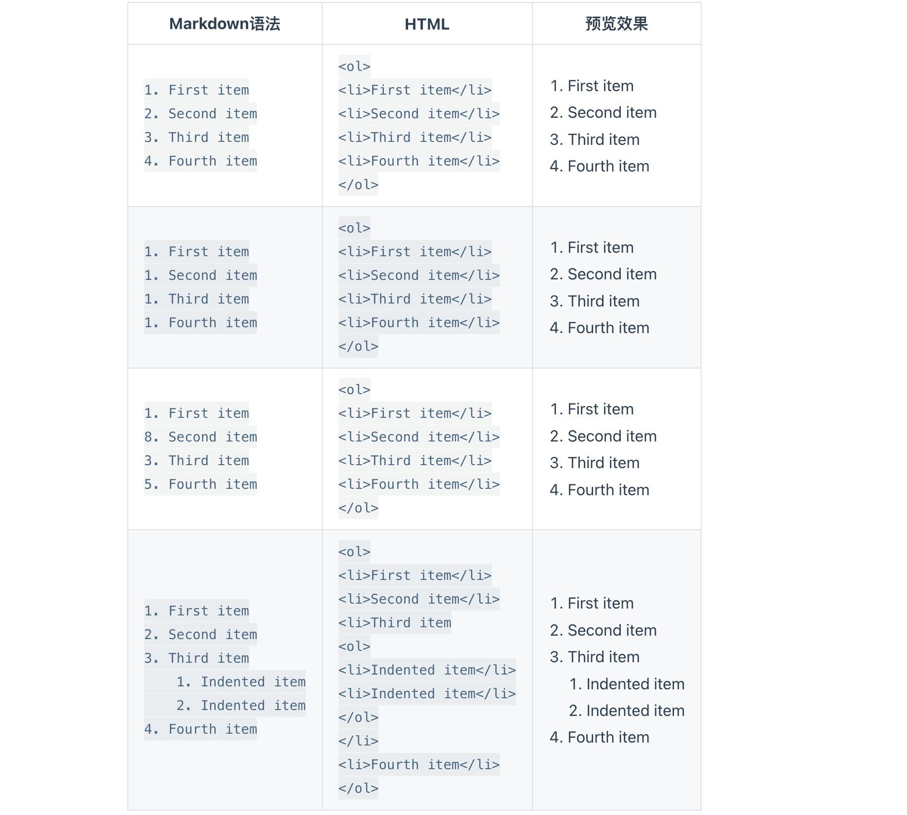
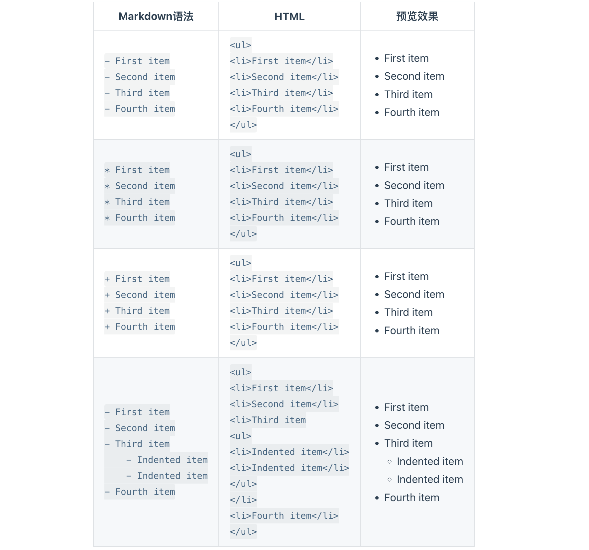

# Markdown List 列表语法

可以将多个条目组织成==有序==或==无序==列表。


## 有序列表

要创建==有序==列表，请在每个列表项前添加数字并紧跟一个英文句点。数字不必按数学顺序排列，但是列表应当以数字 1 起始。




## 无序列表

要创建==无序==列表，请在每个列表项前面添加破折号 (-)、星号 (*) 或加号 (+) 。缩进一个或多个列表项可创建嵌套列表。




#### 无序列表注意事项

在同一列表中，不同列表符号不可以混用。

| ✅ Do this                                            | ❌ Don't do this                                      |
| ---------------------------------------------------- | ---------------------------------------------------- |
| `- First item- Second item- Third item- Fourth item` | `+ First item* Second item- Third item+ Fourth item` |


### 在列表中==嵌套==其他元素

要在保留列表连续性的同时在列表中添加另一种元素，

1. 先换行

2. 清除列表符号（有序/无序），添加所需元素。

3. 后回车创造新行，手动选择或设置接下来需要的列表形式（有序/无序）

4. 减少缩进与其匹配原缩进格式。

   

#### 段落

```text
*   This is the first list item.
*   Here's the second list item.

    I need to add another paragraph below the second list item.

*   And here's the third list item.
```

渲染效果如下：

- This is the first list item.

- Here's the second list item.

  I need to add another paragraph below the second list item.

- And here's the third list item.

  

#### 引用块

```text
*   This is the first list item.
*   Here's the second list item.

    > A blockquote would look great below the second list item.

*   And here's the third list item.
```

渲染效果如下：

- This is the first list item.

- Here's the second list item.

  > A blockquote would look great below the second list item.

- And here's the third list item.

  

#### 代码块

代码块通常采用四个空格或一个制表符缩进。当它们被放在列表中时，请将它们缩进八个空格或两个制表符。

```text
1.  Open the file.
2.  Find the following code block on line 21:

        <html>
          <head>
            <title>Test</title>
          </head>

3.  Update the title to match the name of your website.
```

渲染效果如下：

1. Open the file.

2. Find the following code block on line 21:

   ```text
   <html>
     <head>
       <title>Test</title>
     </head>
   ```

3. Update the title to match the name of your website.

   

#### 图片

```text
1.  Open the file containing the Linux mascot.
2.  Marvel at its beauty.

    

3.  Close the file.
```

渲染效果如下：

1. Open the file containing the Linux mascot.

2. Marvel at its beauty.

   

3. Close the file.

   

#### 列表

You can nest an unordered list in an ordered list, or vice versa.

```text
1. First item
2. Second item
3. Third item
    - Indented item
    - Indented item
4. Fourth item
```

渲染效果如下：

1. First item
2. Second item
3. Third item
   - Indented item
   - Indented item
4. Fourth item
5. Fiveth item

