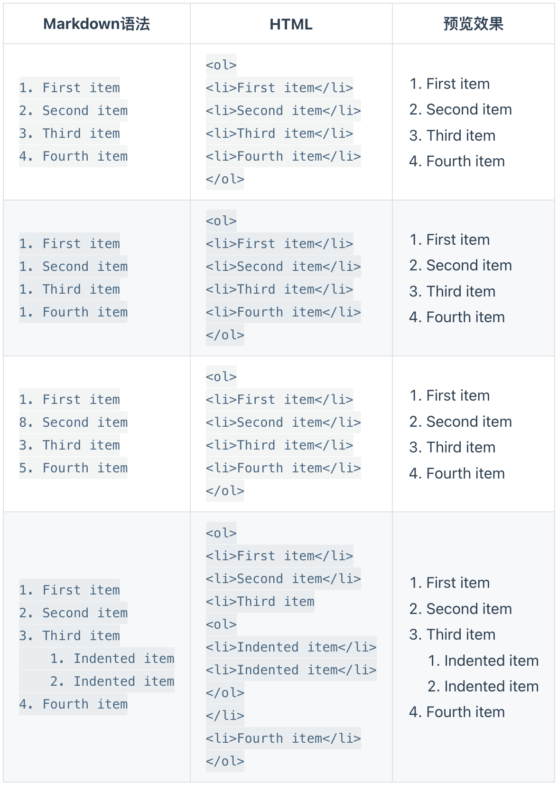
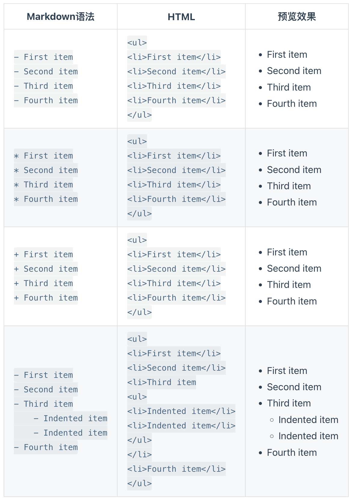

# Markdown 列表语法

可以将多个条目组织成==有序==或==无序==列表。


## 有序列表

要创建==有序==列表，请在每个列表项前添加数字并紧跟一个英文句点。数字不必按数学顺序排列，但是列表应当以数字 1 起始。




## 无序列表

要创建==无序==列表，请在每个列表项前面添加破折号 (-)、星号 (*) 或加号 (+) 。缩进一个或多个列表项可创建嵌套列表。




#### 无序列表注意事项

在同一列表中，不同列表符号不可以混用。

| ✅ Do this                                            | ❌ Don't do this                                      |
| ---------------------------------------------------- | ---------------------------------------------------- |
| `- First item- Second item- Third item- Fourth item` | `+ First item* Second item- Third item+ Fourth item` |


### 在列表中==嵌套==其他元素

要在保留列表连续性的同时在列表中添加另一种元素，

1. 先换行

2. 清除列表符号（有序/无序），添加所需元素。

3. 后回车创造新行，手动选择或设置接下来需要的列表形式（有序/无序）

4. 减少缩进与其匹配原缩进格式。

   

#### 段落

```text
*   This is the first list item.
*   Here's the second list item.

    I need to add another paragraph below the second list item.

*   And here's the third list item.
```

渲染效果如下：

- This is the first list item.

- Here's the second list item.

  I need to add another paragraph below the second list item.

- And here's the third list item.

  

#### 引用块

```text
*   This is the first list item.
*   Here's the second list item.

    > A blockquote would look great below the second list item.

*   And here's the third list item.
```

渲染效果如下：

- This is the first list item.

- Here's the second list item.

  > A blockquote would look great below the second list item.

- And here's the third list item.

  

#### 代码块

代码块通常采用四个空格或一个制表符缩进。当它们被放在列表中时，请将它们缩进八个空格或两个制表符。

```text
1.  Open the file.
2.  Find the following code block on line 21:

        <html>
          <head>
            <title>Test</title>
          </head>

3.  Update the title to match the name of your website.
```

渲染效果如下：

1. Open the file.

2. Find the following code block on line 21:

   ```text
   <html>
     <head>
       <title>Test</title>
     </head>
   ```

3. Update the title to match the name of your website.

   

#### 图片

```text
1.  Open the file containing the Linux mascot.
2.  Marvel at its beauty.

    

3.  Close the file.
```

渲染效果如下：

1. Open the file containing the Linux mascot.

2. Marvel at its beauty.

   ![Tux, the Linux mascot](data:image/png;base64,iVBORw0KGgoAAAANSUhEUgAAAGQAAAB5CAMAAAD4dHQjAAAArlBMVEX////Hx8ePj49XV1c7OzsfHx9JSUlzc3Orq6vx8fHj4+MtLS2BgYG5ubnV1dVlZWWdnZ3///9xXymZeBfClhWnghZwWxpzb2RVRxzdqhP4vhE6Mx2Mbxi0jBUtKR7qtBJxYzhXU0hJRTpIPRzPoBRjURt+ZRl+aShya1WBfXJyZ0b8/Pz5+fn9/f329vbu7u7p6enm5ubv7+/6+vro6Oj39/fz8/Ps7Oz09PTr6+uCz11jAAAAAXRSTlMAQObYZgAABuxJREFUeAG1mgd/ozwShy3gD4g+a/DZgsDeubwlcXq2fP8vdvEAgRCDUthne8EPoxkNI35ZfAhhmBZqbMeVi/nxHB+vcbyZFdLBGYJZHaGPs9gzrpmLIfNbQoxjz5VyH0Pmz4uJSaI5HALTmHNIYmiYYbtI6AhmKV8N1kyr9adTb0FL8mUJ9MSzFLA+KfNLbCcw0eerkqT+WNNHiy/oGc9Gh/iixGg+VjqtIyJG2vNKBJ2IwYTUIP2ZyoslZv9DbXrBQIvxdYlLNQ7Q/MFNOC1zSjyiMJFEIe/u2ubQM9aMEl4pp7lzIopamTmXJAGIXACSqJFwLoy+xPz6Zqw/VrxI4j8hEZyN0Pi2TNNs9R83aCXWjJKAq3e9UTVZ3uTEw1ySCLBOSSnUxbpQqlhfKFWUSDg3s7VhXpokU2pZVEpVxVIpVWXfDa83KRkzSPDfVA3ZFP/DrJJ1pc5QbWeTSGClzrDbqaqcKycCpcqqt47yQqn1fCW8Vau9GpCVmepJ/K/3rk213b+Kpdrn6emX2YZIB9irarXddYqiPLDzmz3XU8sCZ35ZFlVTuuVqw66/omSmU4rHef2+UZtVuS6KwzY/sEJlf3vkzTRE8s0aMjjlOc2Ki10dzuFv8eqpBecrEruZHdy/VEfxj0dMMMvAEgHNtBJ9awss/VdQQzTLUcjBCTrh/VOklUqX313qsGaYuj30pyAvMYwkopbBevnRl46kAY0Sff1IH4IJaRwb+FqFtXMoTZCgh/v5g1xME8gvnuvapLo0hYMevvzkqdeXNIX4yvucyEeNQ9NYwGeT3x1xBE2TfP4k7KDBIg3SxyeTH6IlIQ2c+sD9eFo8H13adXjcUzpL8JF2Yvj6tDMOW4IPdn3OpcV9ySM9og45RoMl391OhIP6TKqHAze7CjDe205iT1u/gw3phh+YkOpLvLgLRIszWDDzfY91R4y0rcur4/kCAwzv3bl360DMtxvxeH1ze3fi9v76eDYU572hWBxI9CaQh/u7Ho/3l29DSXShDALh2u9H0So65HFYYHbX+GN9ICb59QG35enx7i23D/RCWN/b+wrM7VWjpJYfd+e5HnT8hPR7pS0tn8N2qIWXSmMxwJd02143MTp8X2HfobV49TInaIk0jxFX9tMu7xidxeZrBPTr5ddJE73Vur6b5qG/XiT1w3EIhkS3SS4fNZLbIzFRHT1emJ6CTJZ4xPy803FDNT73OmiTYnUSi5hfd3quiIkBpy8Jx14MdJK43uiPd3puX5LikoQu86KVSMDQV9agwqQwJAmtxGglZCPkrOsFXShMZOkkAWqIEghdIINQ+Ih0usi1piUmagRJX+oyMgjFxQnf8Tg5WgkXidHfh3oeukntWRP5Wkk30f1+r+PxIUGHwRaNhEPp0q7n5igd9HB48YRGArfbiHruKfTxCleOP7Zi5EVR7Hnq1HWUjt/kgi/qMGn0gRJgValndts6lnfW1lWETBXo43hjx6EQ+/4rzFgeb97j+EnmXqkdhljh2eNCXqm+xQ95ftDxFGGnlMrRsUzTtMjPnSFs/r9Me2OxvNRX8dHI1TMZWsqseYeIYSwyxlL1WNUhR3SvX61DewWzbu+1yl/n3gt8HFSfDWpcnUUSMsUc8Mw+VS8U/eeWawPbVL2mQE2isfzw0F5apengRo1WEVnIDzs1oHt9bUxbrgQqNUJutg6fE/WWZbf7f09JXKgxVmhbSbkbuw80RFMTy6VRqjGWEHUgKNQIGRqskVmYIWOtxtg0W8VAqsZYo8E9fk6itr6sJWqUFA023YxLzAlJiriW7NRE4hrG1+uRO9coB+6TLlI1SpVrJLzhCzUB9xaBCzXODkxMvzUbfuI+fbmQdXVNVpgjr8Z7sMBGTZGetj32aooVQj4xanrwBFtrsbDWmv9j09NkD16paQroJVUZTBTwk8SFXuLhoKZJEY5Nkj8fKIDSkFuLBDulofDl5c05xRVF9nRK+fmYLMxSacktQVdDzf0V8WuLpZoiyxFoi4tJgTiiy1837ar9vn86UuTgxG5KsYZ/es6jUHrWAEzXI6KrZy6JKDIsMOVkFL4hF++VZGDs2DCESIzA9NEyWpsXtYLBSumpMMrIPW7WjYIxy0rp+ahkCQSyfxbNL2aXrGBHwy9tLfdFlu70zVgvaR2OHM6OblznsVyvlunE4GLFRij4ak+4RmxyfR3OOhZD2qsCvqpcDT08bxpJ/fFD7FzvGCKSGNhevLlMjL/oW77Nx0KLNHzky6pXjXsEi1HscjdoVTGHrNdYwLpINyfDxWr6dWLk9y1Z2d2QltDx0RJzNU5ZijruKsthicVHiFzjRKgN3jOB9f6w3gJWt8lnRzg2ANMJF+f5P0W+bcQV1sTgAAAAAElFTkSuQmCC)

3. Close the file.

   

#### 列表

You can nest an unordered list in an ordered list, or vice versa.

```text
1. First item
2. Second item
3. Third item
    - Indented item
    - Indented item
4. Fourth item
```

渲染效果如下：

1. First item
2. Second item
3. Third item
   - Indented item
   - Indented item
4. Fourth item
5. Fiveth item

