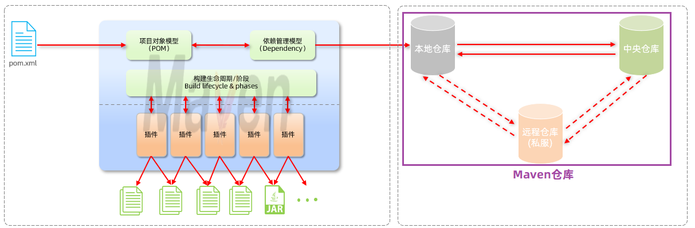
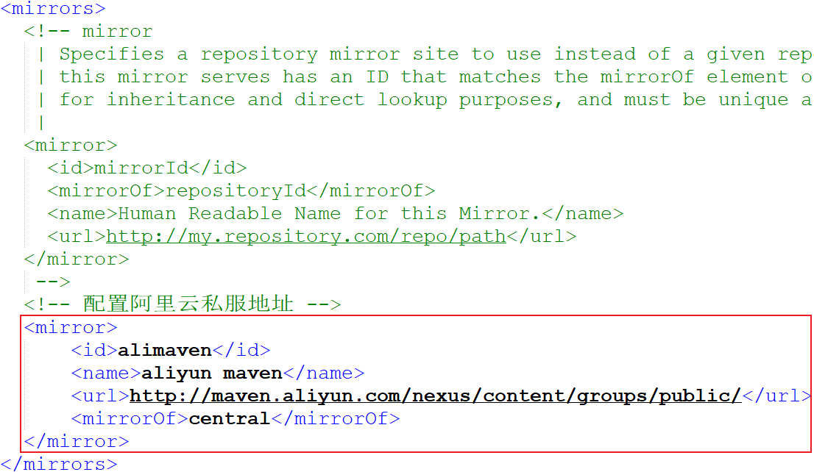
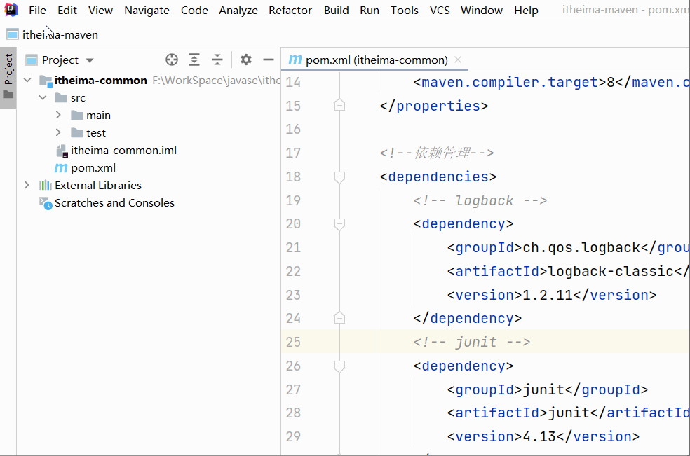
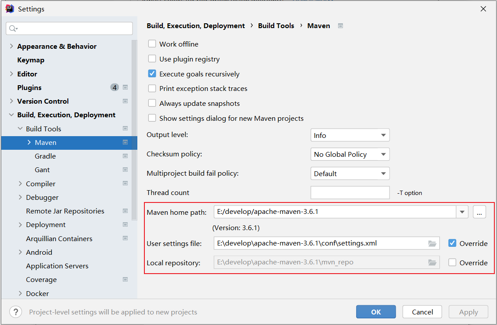
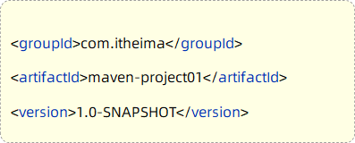
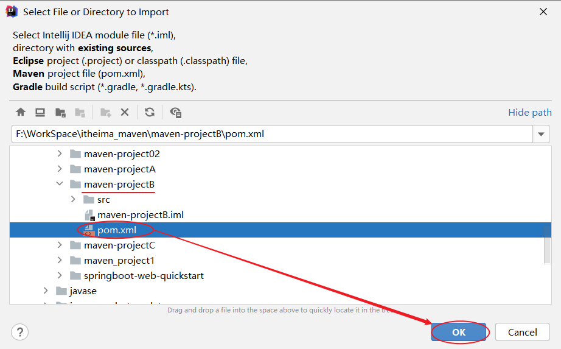
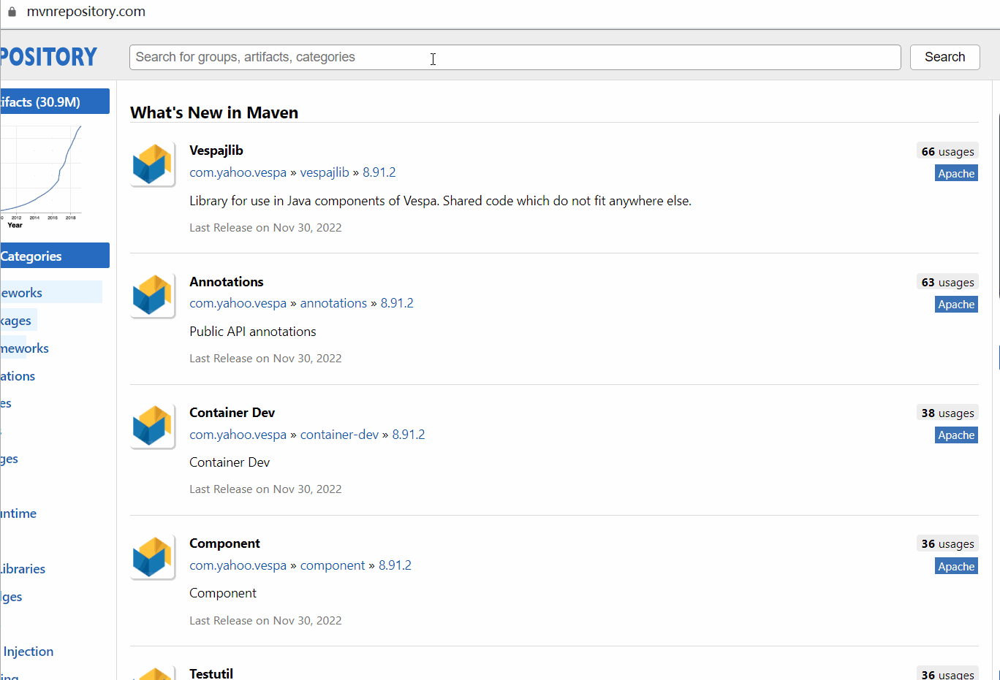
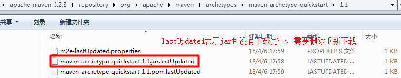

# Maven

## 课程内容

> 1. 初识Maven
> 2. Maven概述
>    - Maven模型介绍
>    - Maven仓库介绍
>    - Maven安装与配置
> 3. IDEA集成Maven
> 4. 依赖管理


## 1. Maven课程介绍

### 1.1 课程安排

学习完前端Web开发技术后，我们即将开始学习后端Web开发技术。做为一名Java开发工程师，**后端Web开发技术是我们学习的重点**。


后端Web开发技术的学习，我们会先学习Java项目的构建工具：Maven


### 1.2 初识Maven

#### 1.2.1 什么是Maven

Maven是Apache旗下的一个开源项目，是一款用于管理和构建java项目的工具。

官网：https://maven.apache.org/

> Apache 软件基金会，成立于1999年7月，是目前世界上最大的最受欢迎的开源软件基金会，也是一个专门为支持开源项目而生的非盈利性组织。
>
> 开源项目：https://www.apache.org/index.html#projects-list


#### 1.2.2 Maven的作用

使用Maven能够做什么呢？

1. 依赖管理
2. 统一项目结构
3. 项目构建


==**依赖管理**：==

- 方便快捷的管理项目依赖的资源(jar包)，避免版本冲突问题


当使用maven进行项目依赖(jar包)管理，则很方便的可以解决这个问题。 我们只需要在maven项目的pom.xml文件中，添加一段如下图所示的配置即可实现。

  


==**统一项目结构 : **==

- 提供标准、统一的项目结构

在项目开发中，当你使用不同的开发工具 (如：Eclipse、Idea)，创建项目工程时：

 

若我们创建的是一个maven工程，是可以帮我们自动生成统一、标准的项目目录结构：


具体的统一结构如下：


> 目录说明： 
>
> - src/main/java: java源代码目录
> - src/main/resources:  配置文件信息
> - src/test/java: 测试代码
> - src/test/resources: 测试配置文件信息


==**项目构建 :**== 

- maven提供了标准的、跨平台(Linux、Windows、MacOS) 的自动化项目构建方式


如上图所示我们开发了一套系统，代码需要进行编译、测试、打包、发布，这些操作如果需要反复进行就显得特别麻烦，而Maven提供了一套简单的命令来完成项目构建。


综上所述，可以得到一个结论：**Maven是一款管理和构建java项目的工具**


## 02. Maven概述

### 2.1 Maven介绍

Apache Maven是一个项目管理和构建工具，它基于项目对象模型(Project Object Model , 简称: POM)的概念，通过一小段描述信息来管理项目的构建、报告和文档。

官网：https://maven.apache.org/

Maven的作用： 

1. 方便的依赖管理
2. 统一的项目结构
3. 标准的项目构建流程


### 2.2 Maven模型

* 项目对象模型 (Project Object Model)
* 依赖管理模型(Dependency)
* 构建生命周期/阶段(Build lifecycle & phases)


1). 构建生命周期/阶段(Build lifecycle & phases)


以上图中紫色框起来的部分，就是用来完成标准化构建流程 。当我们需要编译，Maven提供了一个编译插件供我们使用；当我们需要打包，Maven就提供了一个打包插件供我们使用等。 


2). 项目对象模型 (Project Object Model)


以上图中紫色框起来的部分属于项目对象模型，就是将我们自己的项目抽象成一个对象模型，有自己专属的坐标，如下图所示是一个Maven项目：


> 坐标，就是资源(jar包)的唯一标识，通过坐标可以定位到所需资源(jar包)位置
>
> 


3). 依赖管理模型(Dependency)


以上图中紫色框起来的部分属于依赖管理模型，是使用坐标来描述当前项目依赖哪些第三方jar包


之前我们项目中需要jar包时，直接就把jar包复制到项目下的lib目录，而现在书写在pom.xml文件中的坐标又是怎么能找到所要的jar包文件的呢？

> 答案：Maven仓库


### 2.3 Maven仓库 

仓库：用于存储资源，管理各种jar包

> 仓库的本质就是一个目录(文件夹)，这个目录被用来存储开发中所有依赖(就是jar包)和插件


Maven仓库分为：

- 本地仓库：自己计算机上的一个目录(用来存储jar包)
- 中央仓库：由Maven团队维护的全球唯一的。仓库地址：https://repo1.maven.org/maven2/
- 远程仓库(私服)：一般由公司团队搭建的私有仓库



==当项目中使用坐标引入对应依赖jar包后，首先会查找本地仓库中是否有对应的jar包==

* ==如果有，则在项目直接引用==

* ==如果没有，则去中央仓库中下载对应的jar包到本地仓库==

==如果还可以搭建远程仓库(私服)，将来jar包的查找顺序则变为： 本地仓库 --> 远程仓库--> 中央仓库==


### 2.4 Maven安装

认识了Maven后，我们就要开始使用Maven了，那么首先我们要进行Maven的下载与安装。

#### 2.4.1 下载

下载地址：https://maven.apache.org/download.cgi

在提供的资料中，已经提供了下载好的安装包。如下： 

 


#### 2.4.2 安装步骤

Maven安装配置步骤：

1. 解压安装
2. 配置仓库
3. 配置Maven环境变量


**1、解压 apache-maven-3.6.1-bin.zip（解压即安装）**

> 建议解压到没有中文、特殊字符的路径下。如课程中解压到 `E:\develop` 下。

 

解压缩后的目录结构如下：

 

* bin目录 ： 存放的是可执行命令。（mvn 命令重点关注）
* conf目录 ：存放Maven的配置文件。（settings.xml配置文件后期需要修改）
* lib目录 ：存放Maven依赖的jar包。（Maven也是使用java开发的，所以它也依赖其他的jar包）


**2、配置本地仓库**

2.1、在自己计算机上新一个目录（本地仓库，用来存储jar包）

 


2.2、进入到conf目录下修改settings.xml配置文件 

1). 使用超级记事本软件，打开settings.xml文件，定位到53行

2). 复制<localRepository>标签，粘贴到注释的外面（55行）

3). 复制之前新建的用来存储jar包的路径，替换掉<localRepository>标签体内容


**3、配置阿里云私服**

由于中央仓库在国外，所以下载jar包速度可能比较慢，而阿里公司提供了一个远程仓库，里面基本也都有开源项目的jar包。

进入到conf目录下修改settings.xml配置文件：

1). 使用超级记事本软件，打开settings.xml文件，定位到160行左右

2). 在<mirrors>标签下为其添加子标签<mirror>，内容如下：

```xml
<mirror>  
    <id>alimaven</id>  
    <name>aliyun maven</name>  
    <url>http://maven.aliyun.com/nexus/content/groups/public/</url>
    <mirrorOf>central</mirrorOf>          
</mirror>
```


注意配置的位置，在<mirrors> ... </mirrors> 中间添加配置。如下图所示：



==注:  只可配置一个<mirror>(另一个要注释!) ，不然两个可能发生冲突，导致jar包无法下载!!!!!!!==


**4、配置环境变量**

> Maven环境变量的配置类似于JDK环境变量配置一样

1). 在系统变量处新建一个变量MAVEN_HOME

- MAVEN_HOME环境变量的值，设置为maven的解压安装目录


2). 在Path中进行配置

- PATH环境变量的值，设置为：%MAVEN_HOME%\bin

 


3). 打开DOS命令提示符进行验证，出现如图所示表示安装成功

```
mvn -v
```

 


## 03. IDEA集成Maven

我们要想在IDEA中使用Maven进行项目构建，就需要在IDEA中集成Maven

### 3.1 配置Maven环境 

#### 3.1.1 当前工程设置 

1、选择 IDEA中 File  =>  Settings  =>  Build,Execution,Deployment  =>  Build Tools  =>  Maven

 


2、设置IDEA使用本地安装的Maven，并修改配置文件及本地仓库路径


> Maven home path ：指定当前Maven的安装目录
>
> User settings file ：指定当前Maven的settings.xml配置文件的存放路径
>
> Local repository ：指定Maven的本地仓库的路径 (如果指定了settings.xml, 这个目录会自动读取出来, 可以不用手动指定)


3、配置工程的编译版本为11

- Maven默认使用的编译版本为5（版本过低）

 

上述配置的maven环境，只是针对于当前工程的，如果我们再创建一个project，又恢复成默认的配置了。 要解决这个问题， 我们就需要配置全局的maven环境。

  

#### 3.1.2 全局设置 

1、进入到IDEA欢迎页面

- 选择 IDEA中 File  =>  close project




2、打开 All settings , 选择 Build,Execution,Deployment  =>  Build Tools  =>  Maven




3、配置工程的编译版本为11


这里所设置的maven的环境信息，并未指定任何一个project，此时设置的信息就属于全局配置信息。 以后，我们再创建project，默认就是使用我们全局配置的信息。


### 3.2 Maven项目

#### 3.2.1 创建Maven项目 

1、创建一个空项目 


2、创建模块，选择Maven，点击Next


3、填写模块名称，坐标信息，点击finish，创建完成

 


4、在Maven工程下，创建HelloWorld类


> - Maven项目的目录结构:
>
>   maven-project01
>   	|---  src  (源代码目录和测试代码目录)
>   		    |---  main (源代码目录)
>   			           |--- java (源代码java文件目录)
>   			           |--- resources (源代码配置文件目录)
>   		    |---  test (测试代码目录)
>   			           |--- java (测试代码java目录)
>   			           |--- resources (测试代码配置文件目录)
>   	|--- target (编译、打包生成文件存放目录)


5、编写 HelloWorld，并运行

```java
 
```


#### 3.2.2 POM配置详解

POM (Project Object Model) ：指的是项目对象模型，用来描述当前的maven项目。

- 使用pom.xml文件来实现

pom.xml文件：

~~~xml
<?xml version="1.0" encoding="UTF-8"?>
<project xmlns="http://maven.apache.org/POM/4.0.0"
         xmlns:xsi="http://www.w3.org/2001/XMLSchema-instance"
         xsi:schemaLocation="http://maven.apache.org/POM/4.0.0 http://maven.apache.org/xsd/maven-4.0.0.xsd">
    <!-- POM模型版本 -->
    <modelVersion>4.0.0</modelVersion>

    <!-- 当前项目坐标 -->
    <groupId>com.itheima</groupId>
    <artifactId>maven_project1</artifactId>
    <version>1.0-SNAPSHOT</version>
    
    <!-- 打包方式 -->
    <packaging>jar</packaging>
 
</project>
~~~

pom文件详解：

- <project> ：pom文件的根标签，表示当前maven项目
- <modelVersion> ：声明项目描述遵循哪一个POM模型版本
  - 虽然模型本身的版本很少改变，但它仍然是必不可少的。目前POM模型版本是4.0.0
- 坐标 ：<groupId>、<artifactId>、<version>
  - 定位项目在本地仓库中的位置，由以上三个标签组成一个坐标
- <packaging> ：maven项目的打包方式，通常设置为jar或war（默认值：jar）


#### 3.2.3 Maven坐标详解

什么是坐标？

* Maven中的坐标是==资源的唯一标识== , 通过该坐标可以唯一定位资源位置
* 使用坐标来定义项目或引入项目中需要的依赖

Maven坐标主要组成

* groupId：定义当前Maven项目隶属组织名称（通常是域名反写，例如：com.itheima）
* artifactId：定义当前Maven项目名称（通常是模块名称，例如 order-service、goods-service）
* version：定义当前项目版本号

如下图就是使用坐标表示一个项目：

 

> **注意：**
>
> * 上面所说的资源可以是插件、依赖、当前项目。
> * 我们的项目如果被其他的项目依赖时，也是需要坐标来引入的。


### 3.3 导入Maven项目

- **方式1：使用Maven面板，快速导入项目**

打开IDEA，选择右侧Maven面板，点击 + 号，选中对应项目的pom.xml文件，双击即可


 

> 说明：如果没有Maven面板，选择 View  =>  Appearance  =>  Tool Window Bars
>
>  


- **方式2：使用idea导入模块项目**

File  =>  Project Structure  =>  Modules  =>  +  =>  Import Module


找到要导入工程的pom.xml




## 04. 依赖管理

### 4.1 依赖配置

依赖：指当前项目运行所需要的jar包。一个项目中可以引入多个依赖：

例如：在当前工程中，我们需要用到logback来记录日志，此时就可以在maven工程的pom.xml文件中，引入logback的依赖。具体步骤如下：

1. 在pom.xml中编写<dependencies>标签

2. 在<dependencies>标签中使用<dependency>引入坐标

3. 定义坐标的 groupId、artifactId、version

```xml
<dependencies>
    <!-- 第1个依赖 : logback -->
    <dependency>
        <groupId>ch.qos.logback</groupId>
        <artifactId>logback-classic</artifactId>
        <version>1.2.11</version>
    </dependency>
    <!-- 第2个依赖 : junit -->
    <dependency>
        <groupId>junit</groupId>
        <artifactId>junit</artifactId>
        <version>4.12</version>
    </dependency>
</dependencies>
```

4. 点击刷新按钮，引入最新加入的坐标
   - 刷新依赖：保证每一次引入新的依赖，或者修改现有的依赖配置，都可以加入最新的坐标

  

> 注意事项：
>
> 1. 如果引入的依赖，在本地仓库中不存在，将会连接远程仓库 / 中央仓库，然后下载依赖（这个过程会比较耗时，耐心等待）
> 2. 如果不知道依赖的坐标信息，可以到mvn的中央仓库（https://mvnrepository.com/）中搜索


**添加依赖的几种方式：**

1. 利用中央仓库搜索的依赖坐标

   


2. 利用IDEA工具搜索依赖

   


3. 熟练上手maven后，快速导入依赖

   


### 4.2 依赖传递

#### 4.2.1 依赖具有传递性

早期我们没有使用maven时，向项目中添加依赖的jar包，需要把所有的jar包都复制到项目工程下。如下图所示，需要logback-classic时，由于logback-classic又依赖了logback-core和slf4j，所以必须把这3个jar包全部复制到项目工程下


我们现在使用了maven，当项目中需要使用logback-classic时，只需要在pom.xml配置文件中，添加logback-classic的依赖坐标即可。


在pom.xml文件中只添加了logback-classic依赖，但由于maven的依赖具有传递性，所以会自动把所依赖的其他jar包也一起导入。


依赖传递可以分为：

1. 直接依赖：在当前项目中通过依赖配置建立的依赖关系

2. 间接依赖：被依赖的资源如果依赖其他资源，当前项目间接依赖其他资源

 

比如以上图中：

- projectA依赖了projectB。对于projectA 来说，projectB 就是直接依赖。
- 而projectB依赖了projectC及其他jar包。 那么此时，在projectA中也会将projectC的依赖传递下来。对于projectA 来说，projectC就是间接依赖。


#### 4.2.2 排除依赖

问题：之前我们讲了依赖具有传递性。那么A依赖B，B依赖C，如果A不想将C依赖进来，是否可以做到？ 

答案：在maven项目中，我们可以通过排除依赖来实现。


什么是排除依赖？

- 排除依赖：指主动断开依赖的资源。（被排除的资源无需指定版本）

```xml
<dependency>
    <groupId>com.itheima</groupId>
    <artifactId>maven-projectB</artifactId>
    <version>1.0-SNAPSHOT</version>
   
    <!--排除依赖, 主动断开依赖的资源-->
    <exclusions>
    	<exclusion>
            <groupId>junit</groupId>
            <artifactId>junit</artifactId>
        </exclusion>
    </exclusions>
</dependency>
```


依赖排除示例：

- maven-projectA依赖了maven-projectB，maven-projectB依赖了Junit。基于依赖的传递性，所以maven-projectA也依赖了Junit


- 使用排除依赖后


 


### 4.3 依赖范围

在项目中导入依赖的jar包后，默认情况下，可以在任何地方使用。


如果希望限制依赖的使用范围，可以通过<scope>标签设置其作用范围。

 

作用范围：

1. 主程序范围有效（main文件夹范围内）

2. 测试程序范围有效（test文件夹范围内）

3. 是否参与打包运行（package指令范围内）


如上图所示，给junit依赖通过scope标签指定依赖的作用范围。 那么这个依赖就只能作用在测试环境，其他环境下不能使用。

scope标签的取值范围：

| **scope**值     | **主程序** | **测试程序** | **打包（运行）** | **范例**    |
| --------------- | ---------- | ------------ | ---------------- | ----------- |
| compile（默认） | Y          | Y            | Y                | log4j       |
| test            | -          | Y            | -                | junit       |
| provided        | Y          | Y            | -                | servlet-api |
| runtime         | -          | Y            | Y                | jdbc驱动    |


### 4.4 生命周期

#### 4.4.1 介绍

Maven的生命周期就是为了对所有的构建过程进行抽象和统一。 描述了一次项目构建，经历哪些阶段。

在Maven出现之前，项目构建的生命周期就已经存在，软件开发人员每天都在对项目进行清理，编译，测试及部署。虽然大家都在不停地做构建工作，但公司和公司间、项目和项目间，往往使用不同的方式做类似的工作。

Maven从大量项目和构建工具中学习和反思，然后总结了一套高度完美的，易扩展的项目构建生命周期。这个生命周期包含了项目的清理，初始化，编译，测试，打包，集成测试，验证，部署和站点生成等几乎所有构建步骤。

Maven对项目构建的生命周期划分为3套（相互独立）：


- clean：清理工作。

- default：核心工作。如：编译、测试、打包、安装、部署等。

- site：生成报告、发布站点等。

三套生命周期又包含哪些具体的阶段呢, 我们来看下面这幅图:

 

我们看到这三套生命周期，里面有很多很多的阶段，这么多生命周期阶段，其实我们常用的并不多，主要关注以下几个：

• clean：移除上一次构建生成的文件

• compile：编译项目源代码

• test：使用合适的单元测试框架运行测试(junit)

• package：将编译后的文件打包，如：jar、war等

• install：安装项目到本地仓库


Maven的生命周期是抽象的，这意味着生命周期本身不做任何实际工作。**在Maven的设计中，实际任务（如源代码编译）都交由插件来完成。**


IDEA工具为了方便程序员使用maven生命周期，在右侧的maven工具栏中，已给出快速访问通道


生命周期的顺序是：clean --> validate --> compile --> test --> package --> verify --> install --> site --> deploy 

我们需要关注的就是：clean -->  compile --> test --> package  --> install 

> 说明：在同一套生命周期中，我们在执行后面的生命周期时，前面的生命周期都会执行。

>  思考：当运行package生命周期时，clean、compile生命周期会不会运行？
>
>  ​		clean不会运行，compile会运行。  因为compile与package属于同一套生命周期，而clean与package不属于同一套生命周期。


#### 4.4.2 执行

在日常开发中，当我们要执行指定的生命周期时，有两种执行方式：

1. 在idea工具右侧的maven工具栏中，选择对应的生命周期，双击执行
2. 在DOS命令行中，通过maven命令执行


**方式一：在idea中执行生命周期**

- 选择对应的生命周期，双击执行

 


compile：


test：


package：


install：


clean：


**方式二：在命令行中执行生命周期**

1. 进入到DOS命令行


 


 

## 05. 附录

### 5.1 更新依赖索引

有时候给idea配置完maven仓库信息后，在idea中依然搜索不到仓库中的jar包。这是因为仓库中的jar包索引尚未更新到idea中。这个时候我们就需要更新idea中maven的索引了，具体做法如下：

 打开设置----搜索maven----Repositories----选中本地仓库-----点击Update


### 5.2 清理maven仓库

初始情况下，我们的本地仓库是没有任何jar包的，此时会从私服去下载（如果没有配置，就直接从中央仓库去下载），可能由于网络的原因，jar包下载不完全，这些不完整的jar包都是以lastUpdated结尾。此时，maven不会再重新帮你下载，需要你删除这些以lastUpdated结尾的文件，然后maven才会再次自动下载这些jar包。




如果本地仓库中有很多这样的以lastUpadted结尾的文件，可以定义一个批处理文件，在其中编写如下脚本来删除： 

~~~
set REPOSITORY_PATH=E:\develop\apache-maven-3.6.1\mvn_repo
rem 正在搜索...

del /s /q %REPOSITORY_PATH%\*.lastUpdated

rem 搜索完毕
pause
~~~


操作步骤如下：

1). 定义批处理文件del_lastUpdated.bat  (直接创建一个文本文件，命名为del_lastUpdated，后缀名直接改为bat即可 )

 

2). 在上面的bat文件上**右键---》编辑** 。修改文件：

 

修改完毕后，双击运行即可删除maven仓库中的残留文件。


