# 1 MySql 起步

## 1.1 MySql 简介

本文介绍了什么是数据库，什么是 MySQL 以及 MySQL 的特点。

==MySQL 是一个数据库管理系统。==如果我们要了解 MySQL 是什么，我们首先需要了解什么是数据库。


### 1.1.1 数据库介绍

顾名思义，数据库就是存档某些数据的仓库。但是这个仓库不是一个实体仓库，也不存储实体物品，而是存放数据。比如我们常见的：

- 我们在大型超市购物时，我们购买的商品的价格和折扣等信息就存在一个数据库中。
- 我们手机上的联系人信息是一个列表，这个列表数据也存在一个数据库中。
- 电子商务网站中的商品的库存和价格信息也存在于服务器的数据库中。
- 汽车 4S 店的服务客户的记录信息也会存储在一个数据库中。

可以说，在现在的信息化系统中，数据库无处不在。

数据库是一个以某种有组织的方式存储的数据集合。当人们收集了大量的数据后，应该把它们保存起来进一步的处理，进一步地抽取有用的信息。现在人们借助计算机和数据库技术科学地保存了大量的数据，以便更好地利用这些数据资源。


### 1.1.2 MySQL 简介

MySQL 是一个开放源码的关系数据库管理系统，开发者为瑞典 MySQL AB 公司。目前 MySQL 被广泛地应用在 Internet 上的大中小型网站中。由于其体积小、速度快、总体拥有成本低，尤其是开放源码这一特点，许多中小型网站为了降低网站总体拥有成本而选择了 MySQL 作为网站数据库。

MySQL 这个名字是怎么来的已经不清楚了。一些基本指南和大量的库和工具都使用 `my` 前缀很长时间了，这可能是一个原因。 MySQL AB 创始人之一的 [Monty Widenius](https://zh.wikipedia.org/wiki/米卡埃爾·維德紐斯)的女儿也叫 My。 MySQL 这个名字到底来源于哪一个原因，包括开发者在内也不知道。

MySQL 的海豚标志的名字叫 “sakila”，它是由 MySQL AB 的创始人从用户在“海豚命名”的竞赛中建议的大量的名字表中选出的。获胜的名字是由来自非洲斯威士兰的开源软件开发者 Ambrose Twebaze 提供。根据 Ambrose 所说，Sakila 来自一种叫 SiSwati 的斯威士兰方言，也是在 Ambrose 的家乡乌干达附近的坦桑尼亚的 Arusha 的一个小镇的名字。

2008 年 1 月 16 日 MySQL AB 被 Sun 公司收购。而 2009 年，SUN 又被 Oracle 收购。就这样如同一个轮回，MySQL 成为了 Oracle 公司的另一个数据库项目。

MySQL 是数据库的一种，具有数据库的通用特征，同时，比起其他类型的数据库，它还具有自己鲜明的特点。

MySQL 是一个小型的开源的关系型数据库管理系统。与其他大型数据库管理系统例如 Oracle、DB2、SQL Server 等相比，MySQL 规模小，功能有限，但是它体积小、速度快、成本低，且它提供的功能对稍微复杂的应用已经够用，这些特性使得 MySQL 成为世界上最受欢迎的开放源代码数据库。

MySQL 是一种开放源代码的关系型数据库管理系统（RDBMS），MySQL 数据库系统使用最常用的数据库管理语言——结构化查询语言（SQL）进行数据库管理。

由于 MySQL 是开放源代码的，因此任何人都可以在 General Public License 的许可下下载并根据个性化的需要对其进行修改。MySQL 因为其速度、可靠性和适应性而备受关注。大多数人都认为在不需要事务化处理的情况下，MySQL 是管理内容最好的选择。


### 1.1.3 MySQL 版本

针对不同的用户，MySQL 分为两个不同的版本：

- MySQL 社区版：该版本完全免费，但是官方不提供技术支持。用户可以自由下载使用。
- MySQL 企业版服务器：为企业提供数据库应用，支持 ACID 事务处理，提供完整的提交、回滚、崩溃恢复和行政锁定功能。需要付费使用，官方提供技术支持。

对绝大多数应用而言，MySQL 社区版都能满足。

MySQL 可以在 UNIX、Linux、Windows 等各种平台上运行。并且不管是服务器还是桌面版本的 PC，都可以安装 MySQL，并且 MySQL 在各个平台都很可靠且速度快。

如果您开发网站或 Web 应用程序，MySQL 是一个不错的选择。MySQL 是 LAMP 堆栈的重要组件。 LAMP 网站架构是目前国际流行的 Web 框架， 其中包括 Linux、Apache、MySQL 和 PHP。


## 1.2 在 Windows 上安装 MySQL

在本教程中，我们展示如何在 Windows 平台上下载和安装 MySQL 的详细步骤。

在 Windows 平台上安装 MySQL 很简单，并不需要太复杂的步骤。按照本文的步骤操练起来就可以了。


### 1.2.1 下载 MySQL 安装程序

我们需要使用 MySQL 提供的安装程序在 Windows 平台上安装 MySQL。

请转到 [MySQL 官方下载页面](https://dev.mysql.com/downloads/installer/)下载 MySQL 安装程序。下载页面提供了 2 个安装程序文件供下载：

- **在线安装版**：安装过程中需要联网下载用户选择的组件再进行安装。 对应的文件是 `mysql-installer-web-community-<version>.msi`，文件大小约有 2M。
- **完整安装版**：包含了全部组件，安装过程中不需要联网。 对应的文件是 `mysql-installer-community-<version>.exe`，文件大小约有 450M。

两个安装程序安装完成后的结果完全一样，您可以根据自己的需要选择下载。这里我们选择下载**在线安装版**。


### 1.2.2 安装 MySQL 数据库

下载安装程序后，双击安装文件开始安装过程。

1. 在**选择安装类型**页面上，您可以看到五个安装选项。

   - **Developer Default**：默认的安装选项。它安装开发应用程序所需的组件，例如 MySQL 服务器、MySQL Shell、MySQL 连接器等
   - **Server Only**：只安装 MySQL 服务器端，不包含命令行工具等组件。
   - **Client Only**：只安装 MySQL 客户端工具等组件，不包含 MySQL Server。
   - **Full**：安装 MySQL 服务器及其所有组件
   - **Custom**：自定义安装自己所需的组件

   我们安装 MySQL 服务器以及所有组件的，选择 “**Full**” 并单击 “**Next**” 。

   

   

   

2. 检查所需组件

   在安装开始之前，安装程序会检查安装所需的先决条件。界面上会显示产品名称、所需组件/软件及其状态。可以看到，安装 `MySQL for visual studio` ，必须安装 visual studio 2015 或以上版本。同样，要安装 `Connector/Python 8.0.19`，我们必须先安装 python。

   - 如果本页有 “**Execute**“ 按钮，则先点击 “**Execute**“ 按钮，然后单击 “**Next**”。
   - 如果没有 “**Execute**“ 按钮，则直接单击 “**Next**”。

   

   

   

   安装程序向我们发出警告。我们继续安装，单击 “**Yes**“。

   

   

   

3. 安装所选产品组件

   在安装界面上，您可以看到将要安装的 MySQL 产品/软件的列表。查看列表并单击 “**Execute**“。

   

   

   

   安装程序会自动下载所有产品/软件，然后，它会自动安装所有产品。

   

   

   

   等待几分钟。安装过程完成后，我们就可以配置 MySQL 数据库服务器和其他组件了。单击 “**Next**” 进入配置界面。

   

   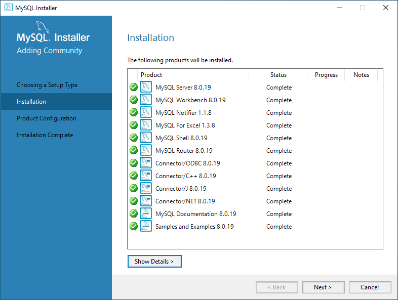

   

4. 产品配置

   在产品配置界面上，您可以看到需要配置的产品列表。单击“**Next**”。

   

   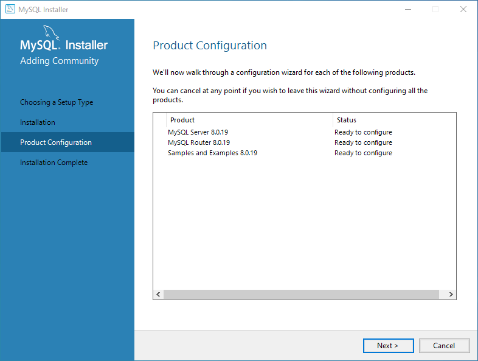

   

5. 配置高可用性

   在高可用性界面上，我们选择 “**Standalone MySql Server / Classic MySQL Replication**”。这是选择我们服务器作为独立服务器或者经典的 MySQL 复制服务器。

   

   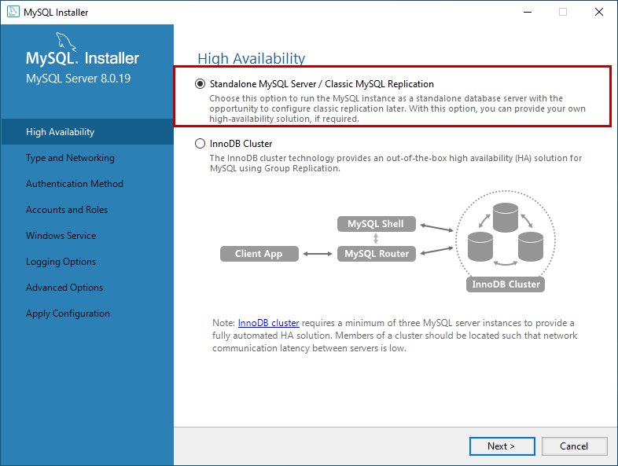

   

6. 配置服务器类型和网络

   在**类型和网络**界面上，我们可以配置以下内容：

   - Config Type: 配置类型
     - Development Computer: 开发计算机，占用最少的资源。
     - Server Computer: 服务器计算机，可以和其他服务器软件一同安装，比如 web 服务器等。中等资源占用。
     - Dedicated Computer: 专用计算机，可最大限度的占用资源。
   - Connectivity：可以控制客户端如何连接到 MySQL 数据库

   

   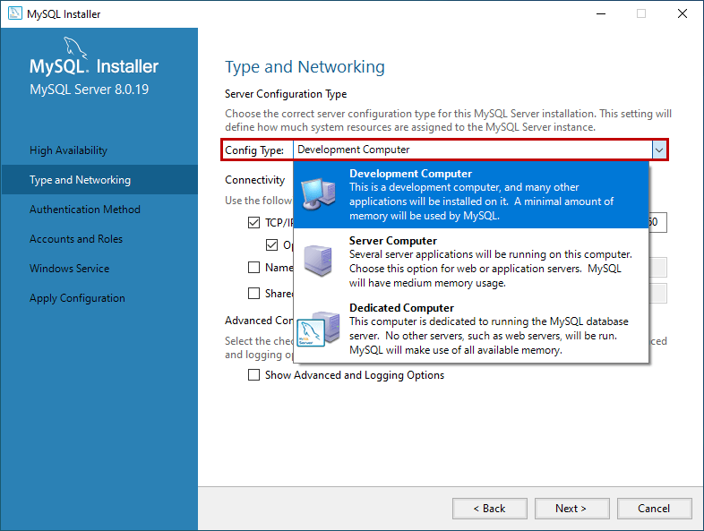

   

   

   

   

7. 配置认证方法

   在 MySQL 8.0 版本中，我们可以使用基于 SHA256 的强密码。在 **Authentication Method** 界面上，选择使用传统身份验证方法或强密码进行身份验证的选项。注意：如果使用强密码加密进行身份验证，请确保所有客户端或者连接器必须更新到最新版本。我们使用**强密码加密进行身份验证**。

   

   

   

8. 配置账户和角色

   在 **Accounts and Roles** 界面上，您可以指定 MySQL 的 `root` 帐户密码。MySQL `root` 帐户是默认的 sysadmin 帐户，为了安全，一般要禁用它。

   

   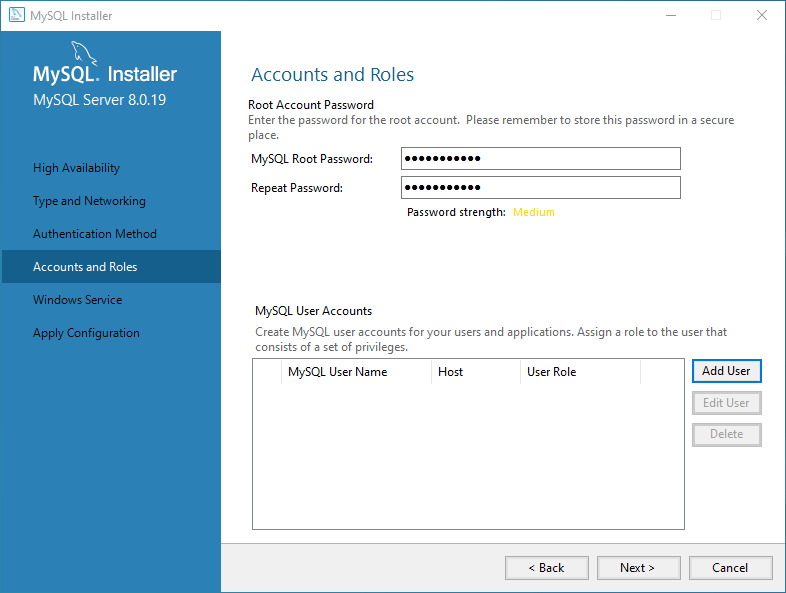

   

9. 配置 Windows 服务

   在**Windows 服务**界面上，可以将 MySQL 服务器配置为作为 Windows 服务运行。我们可以自定义服务器的名称以及是否随机自启动服务。

   

   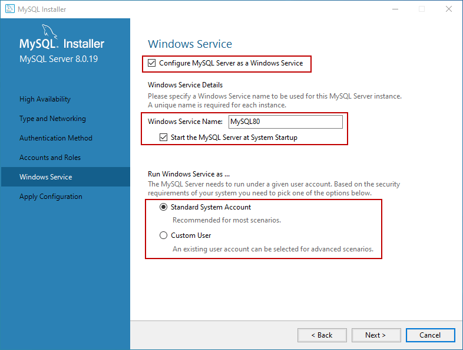

   

10. 将配置生效

    在 “**Apply Configuration**” 界面上，我们可以看到保存配置的步骤。检查所有配置设置后，单击 “**Execute**”。

    

    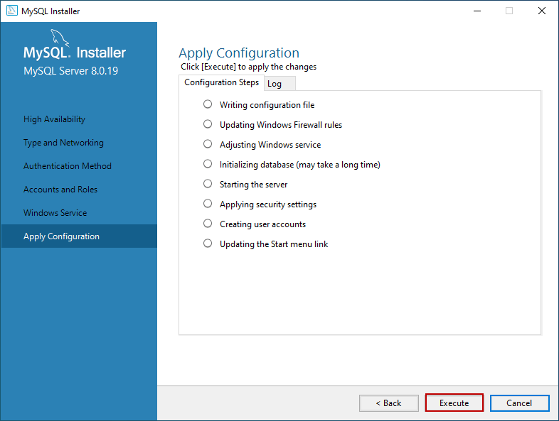

    

    等待配置保存成功后，单击 “**Finish**” 关闭安装程序。

    

    

    

### 1.2.3 安装示例数据库

完成上面的步骤后，如果安装开始选择是完整安装类型，则安装程序继续回到产品配置界面。点击 **Next**，MySQL 安装程序将继续安装示例数据库。

1. 在此界面上，输入用户名 `root` 和密码，然后单击 “Check” 。如果连接建立成功，点击下一步。见下图：

   

   

   

2. 在 **Apply Configuration Screen** 上，单击 **Execute** 开始安装示例数据库。请参阅以下内容：

   

   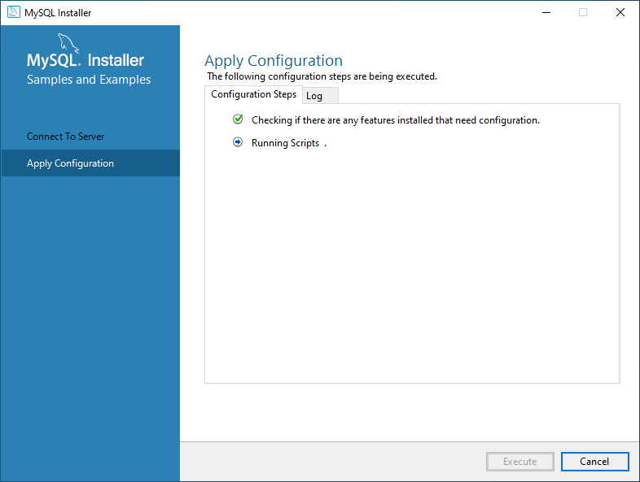

   

   安装示例数据库后，单击“**完成”**按钮。

   

   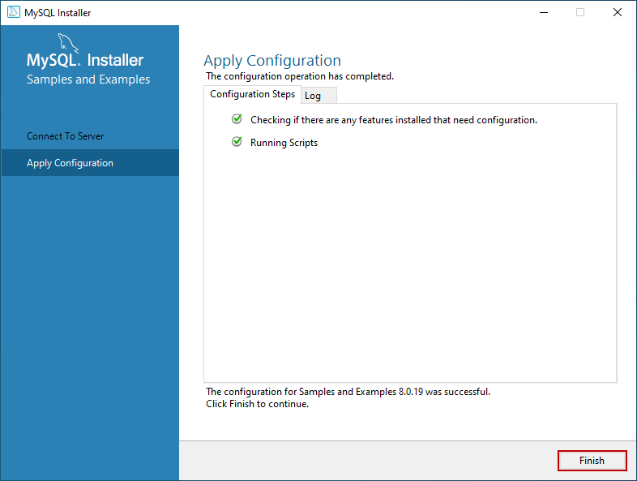

   

3. 安装程序继续到**产品配置**界面。在此界面上，您可以看到 **MySQL Server 8.0.19** 和 **Sample 和 Example 8.0.19** 的安装已成功完成。见下图：

   

   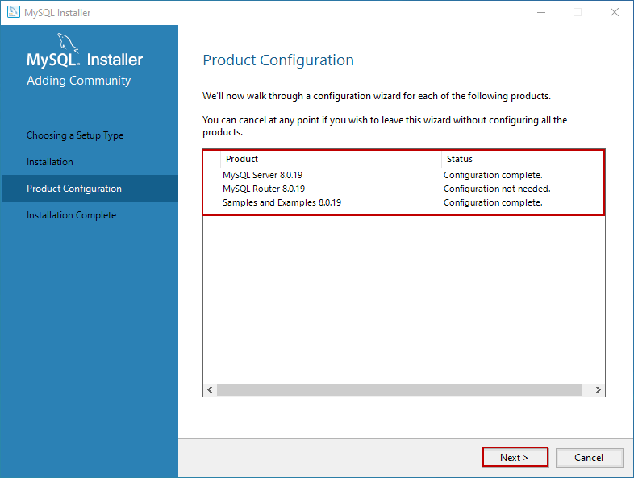

   

4. 安装完成后，您可以将安装日志复制到剪贴板上以供日后查看。此外，如果您想立即开始探索 MySQL，那么您可以选择“**Start MySQL Workbench after Setup**” 和 “**Start MySQL Shell after Setup**”，然后单击**完成**。见下图：

   

   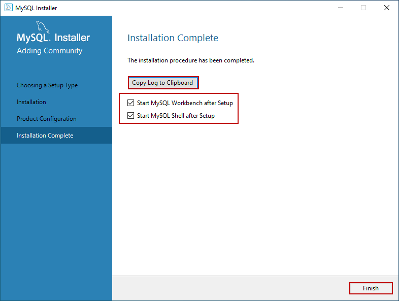

   

完成后， MySQL 安装程序在数据库中导入了 `world` 和 `sakila` 数据库：

- `world` 数据库是一个包含了世界国家和城市的数据。
- `sakila` 数据库是关于 DVD（电影）租赁店业务的数据库。


### 1.2.4 连接到 MySQL 服务器

安装完 MySQL 服务器之后，可以通过 MySQL 命令行工具或者其他 MySQL 客户端程序（比如：MySQL Workbench， Navicat 等） 连接到 MySQL 服务器。更详细的介绍请跳转到[连接到 MySQL 服务器](https://www.sjkjc.com/mysql/connect/)教程。


## 1.3 在 MacOS 上安装 MySQL

本教程中，我们展示了在 MacOS 上安装 MySQL 8 的详细步骤。

在 MacOS 上有两种方式安装 MySQL 服务器：通过 brew 安装和通过安装包安装。


### 1.3.1 通过 brew 安装 MySQL

在 MacOS 上，我们可以通过 brew 很容易地安装 MySQL。


**安装 MySQL**

```bash
brew install mysql
```


**启动 MySQL 服务器**

```bash
brew services start mysql
```


**配置 MySQL 服务器**

我们需要运行以下脚本配置 MySQL 服务器的安全性：

```bash
mysql_secure_installation
```

在这个过程中，你可以设置 root 的密码，配置一些选项以增强 MySQL 服务器的安全性。你会看到如下类似的输出：

```txt
Securing the MySQL server deployment.

Connecting to MySQL using a blank password.

VALIDATE PASSWORD COMPONENT can be used to test passwords
and improve security. It checks the strength of password
and allows the users to set only those passwords which are
secure enough. Would you like to setup VALIDATE PASSWORD component?

Press y|Y for Yes, any other key for No: Y

There are three levels of password validation policy:

LOW    Length >= 8
MEDIUM Length >= 8, numeric, mixed case, and special characters
STRONG Length >= 8, numeric, mixed case, special characters and dictionary                  file

Please enter 0 = LOW, 1 = MEDIUM and 2 = STRONG: 0
Please set the password for root here.

New password:

Re-enter new password:

Estimated strength of the password: 25
Do you wish to continue with the password provided?(Press y|Y for Yes, any other key for No) : Y
By default, a MySQL installation has an anonymous user,
allowing anyone to log into MySQL without having to have
a user account created for them. This is intended only for
testing, and to make the installation go a bit smoother.
You should remove them before moving into a production
environment.

Remove anonymous users? (Press y|Y for Yes, any other key for No) : Y
Success.


Normally, root should only be allowed to connect from
'localhost'. This ensures that someone cannot guess at
the root password from the network.

Disallow root login remotely? (Press y|Y for Yes, any other key for No) : Y
Success.

By default, MySQL comes with a database named 'test' that
anyone can access. This is also intended only for testing,
and should be removed before moving into a production
environment.


Remove test database and access to it? (Press y|Y for Yes, any other key for No) : Y
 - Dropping test database...
Success.

 - Removing privileges on test database...
Success.

Reloading the privilege tables will ensure that all changes
made so far will take effect immediately.

Reload privilege tables now? (Press y|Y for Yes, any other key for No) : Y
Success.

All done!
```


**MySQL 服务器管理命令**

==brew 提供了实用的命令可以管理 MySQL 服务器。==

- ==`brew services start mysql`: 启动 MySQL 服务器，并设置为自启动。==
- ==`brew services stop mysql`: 停止 MySQL 服务器，并设置为不自启动。==
- ==`brew services run mysql`: 只启动 MySQL 服务器。==
- ==`mysql.server start`: 启动 MySQL 服务器。==
- ==`mysql.server stop`: 停止 MySQL 服务器。==


### 1.3.2 通过安装包安装 MySQL

通过安装包安装 MySQL 的过程有友好的 UI 界面，更加的方便快捷。


**下载安装包**

请点击[此处链接](https://dev.mysql.com/downloads/mysql/)去下载 MySQL 社区版的 `dmg` 文件，它包含了 MySQL 的安装器。


**安装 MySQL**

下载安装包后，请按照以下步骤进行安装：

1. 双击下载 `dmg` 文件。双击后，会看到 MySQL 安装器文件，比如： `mysql-8.0.26-macos-10.13-x86_64.pkg`。双击 MySQL 安装器文件。
2. 在介绍页面，直接点击 “继续” 按钮。
3. 在 “许可” 页面，直接点击 “继续” 按钮。
4. 在 “安装类型” 页面，可以直接点击 “安装” 按钮，也可以先点击 “自定义” 按钮选择要安装的组件后再点击 “安装” 按钮。
5. 在 “配置” 页面，密码加密方式选择 `Use Strong Password Entryption`。然后，输入 root 用户的密码。点击 “Finish” 按钮就完成安装了


**管理 MySQL**

MySQL 偏好窗格会被默认安装。你可以在 系统偏好 窗口中找到它。MySQL 偏好窗格允许你启动、停止和配置 MySQL。


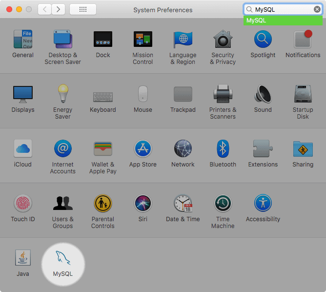


## 1.4 在 CentOS 上安装 MySQL

本教程中，我们展示了在 CentOS 8/7/6 上安装 MySQL 8 的详细步骤。

CentOS 是一个使用非常广泛的 Linux 发行版，CentOS 属于 RedHat 架构。本教程中，我们展示了在 CentOS 8/7/6 上安装 MySQL 8 的详细步骤。

==**先决条件**==

==请使用 root 用户，或者具有管理员权限的用户登录系统，完成以下操作。==


### 1.4.1 在 CentOS 中安装 MySQL

**1. 下载安装 MySQL Yum 仓库**

请按照自己不同的系统执行以下命令下载安装 MySQL Yum 仓库：

- CentOS 8

  ```bash
  wget https://repo.mysql.com/mysql80-community-release-el8-1.noarch.rpm
  yum localinstall mysql80-community-release-el8-1.noarch.rpm
  ```

- CentOS 7

  ```bash
  wget https://repo.mysql.com/mysql80-community-release-el7-1.noarch.rpm
  yum localinstall mysql80-community-release-el7-1.noarch.rpm
  ```

- CentOS 6

  ```bash
  wget https://dev.mysql.com/get/mysql80-community-release-el6-1.noarch.rpm
  yum localinstall mysql80-community-release-el6-1.noarch.rpm
  ```


**2. 安装 MySQL 8 社区服务器**

执行以下命令安装 MySQL 8：

```bash
yum install mysql-community-server -y
```


**3. 启动 MySQL 服务**

根据自己不同的系统版本使用以下命令启动 mysql 服务：

- CentOS 8 或 CentOS 7

  ```bash
  systemctl start mysql
  ```

- CentOS 6

  ```bash
  service mysqld start
  ```


**4. 显示 `root` 用户的默认密码**

安装 MySQL 8.0 时，会自动为 `root` 用户生成一个临时密码，并记录在日志文件里。请使用以下命令查看 `root` 用户的临时密码：

```bash
grep "A temporary password" /var/log/mysqld.log
```

这是输出：

```txt
[Note] A temporary password is generated for root@localhost: Liaka*(Dka&^Kjs
```

请注意，您本地的临时密码是不同的。您要根据此密码来更改 `root` 用户的密码。


**5. MySQL 安全配置**

执行以下 `mysql_secure_installation` 命令来保护 MySQL 服务器：

```bash
mysql_secure_installation
```

它会提示您输入 `root` 帐户的当前密码：


```txt
Enter password for user root:
```

输入上面的临时密码，然后按下回车键。将显示以下消息：


```txt
The existing password for the user account root has expired. Please set a new password.

New password:
Re-enter new password:
```

请输入 `root` 用户的新密码和确认密码。

配置过程中它会提示配置一些安全选项，为了服务器的安全，应该选择 `y`。这些问题包括：

- `Remove anonymous users? (Press y|Y for Yes, any other key for No) : y`

  删除匿名用户？（按 y|Y 表示是，任何其他键表示否）：y

- `Disallow root login remotely? (Press y|Y for Yes, any other key for No) : y`

  禁止远程 root 登录？（按 y|Y 表示是，任何其他键表示否）：y

- `Remove test database and access to it? (Press y|Y for Yes, any other key for No) : y`

  删除测试数据库并访问它？（按 y|Y 表示是，任何其他键表示否）：y

- `Reload privilege tables now? (Press y|Y for Yes, any other key for No) : y`

  现在重新加载权限表？（按 y|Y 表示是，任何其他键表示否）：y

### 6. MySQL 服务控制命令

安装完成后，MySQL 服务就会自动启动。我们可以通过以下几个命令查看 MySQL 服务的状态，启动、停止、重启 MySQL 服务器：

- CentOS 8 或 CentOS 7
  - 查看 MySQL 服务器状态： `systemctl status mysqld`
  - 启动 MySQL 服务器： `systemctl start mysqld`
  - 停止 MySQL 服务器： `systemctl stop mysqld`
  - 重启 MySQL 服务器： `systemctl restart mysqld`
  - 配置 MySQL 服务器自启动： `systemctl enable mysqld`
- CentOS 6
  - 查看 MySQL 服务器状态： `servie mysqld status`
  - 启动 MySQL 服务器： `servie mysqld start`
  - 停止 MySQL 服务器： `servie mysqld stop`
  - 重启 MySQL 服务器： `servie mysqld restart`
  - 配置 MySQL 服务器自启动： `chkconfig mysqld on`

### 7. 连接到 MySQL 服务器

请使用以下命令连接到 MySQL 服务器：


```bash
mysql -u root -p
```

然后根据提示输入 root 帐户的密码，并按 `Enter` 键。验证通过后，将显示以下输出代表进入了 MySQL 控制台：


```bash
mysql>
```

使用 [`SHOW DATABASES`](https://www.sjkjc.com/mysql/show-databases/) 显示当前服务器中的所有数据库：


```sql
mysql> show databases;
```

这是输出：


```txt
+--------------------+
| Database           |
+--------------------+
| information_schema |
| mysql              |
| performance_schema |
| sys                |
+--------------------+
4 rows in set (0.05 sec)
```

上面显示的数据库，是 MySQL 服务器自带数据库。