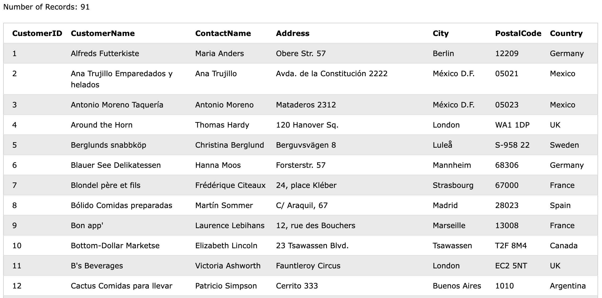
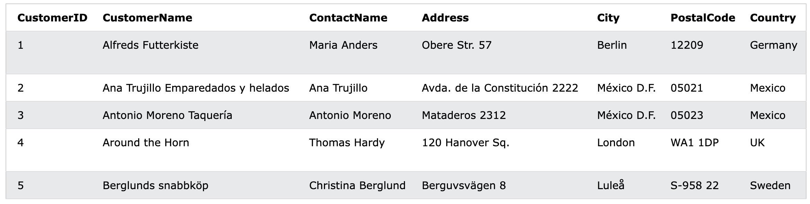

# SQL Fundamental

## 1. Basic

### 1.1 Introduction to SQL

==**SQL is a standard language for accessing and manipulating databases.**==

#### 1.1.1 What is SQL

- SQL stands for Structured Query Language
  - A **==query==** in a database is a <u>request</u> for information from a database management system (DBMS), which is the software program that maintains data. <u>Users can make a query to retrieve data or change information in a database, such as adding or removing data.</u>
  - Query -> operations to data
- SQL lets you access and manipulate databases
- SQL became a standard of the American National Standards Institute (ANSI) in 1986, and of the International Organization for Standardization (ISO) in 1987

> Note: SQL is a Standard - BUT....
>
> Although SQL is an ANSI/ISO standard, there are **different versions of the SQL language**.
>
> However, to be compliant with the ANSI standard, they all support at least the major commands (such as `SELECT`, `UPDATE`, `DELETE`, `INSERT`, `WHERE`) in a similar manner.


#### 1.1.2 What Can SQL do?

- SQL can **execute** queries against a database
- SQL can **retrieve** data from a database
- SQL can **insert** records in a database
- SQL can **update** records in a database
- SQL can **delete** records from a database
- SQL can **create new databases**
- SQL can **create new tables in a database**
- SQL can **create stored procedures in a database**
- SQL can **create views in a database**
- SQL can set **permissions** on tables, procedures, and views
  

#### 1.1.3 Using SQL in Your Web Site and RDBMS

To build a web site that shows data from a database, you will need:

- An ==RDBMS== database program (i.e. MS Access, SQL Server, MySQL)

  - RDBMS stands for **Relational Database Management System**. **RDBMS is the basis for SQL,** and for all modern database systems such as MS SQL Server, IBM DB2, Oracle, MySQL, and Microsoft Access. **The data in RDBMS is stored in database objects called ==tables==.** 

  - A table is a collection of related data entries and it consists of columns and rows.

    

    - **Every table is broken up into smaller entities called fields.** The fields in the Customers table consist of CustomerID, CustomerName, ContactName, Address, City, PostalCode and Country. **A field is a column in a table that is designed to maintain specific information about every record in the table.**
    - **A record, also called a row, is each individual entry that exists in a table.** For example, there are 91 records in the above Customers table. A record is a horizontal entity in a table.

- To use a ==server-side scripting language==, like PHP or ASP

- To use ==SQL== to get the data you want

- To use ==HTML / CSS== to style the page


### 1.2 Syntax

#### 1.2.1 Database Tables

**A database most often contains one or more tables. Each table is identified by a name** (e.g. "Customers" or "Orders"). Tables contain records (rows) with data.

In this tutorial we will use the well-known Northwind sample database (included in MS Access and MS SQL Server).

Below is a selection from the "Customers" table:



The table above contains five records (one for each customer) and seven columns (fields - CustomerID, CustomerName, ContactName, Address, City, PostalCode, and Country).


#### 1.2.2 SQL Statements

Most of the actions you need to perform on a database are done with **SQL statements.**

The following SQL statement selects all the records in the "Customers" table:

```sql
SELECT * FROM Customers;
```

> ⚠️Note: Keep in Mind That SQL keywords are **NOT case sensitive: `select` is the same as `SELECT`**


#### 1.2.3 Some of The Most Important SQL Commands

- `SELECT` - extracts data from a database
- `UPDATE` - updates data in a database
- `DELETE` - deletes data from a database
- `INSERT INTO` - inserts new data into a database
- `CREATE DATABASE` - creates a new database
- `ALTER DATABASE` - modifies a database
- `CREATE TABLE` - creates a new table
- `ALTER TABLE` - modifies a table
- `DROP TABLE` - deletes a table
- `CREATE INDEX` - creates an index (search key)
- `DROP INDEX` - deletes an index


### 1.3 Select Statement

#### 1.3.1 The SQL Select Statement

The **`SELECT` statement** is used to select data from a database.

==The data returned is stored in a result table, called the **result-set**.==

```sql
SELECT column1, column2, ...
FROM table_name;
```

Here, column1, column2, ... are the field names of the table you want to select data from. If you want to select all the fields available in the table, use the following syntax:

```sql
SELECT * FROM table_name;
```

> \* means all the fields in a table.


#### 1.3.2 The SQL Select Distinct Statement

**The `SELECT DISTINCT` statement is used to return only ==distinct (different) values==.**

Inside a table, a column often contains many duplicate values; and sometimes you only want to list the different (distinct) values.

The following SQL statement selects only the **DISTINCT** values from the "Country" column in the "Customers" table:

```sql
SELECT DISTINCT Country FROM Customers;
```

The following SQL statement lists **The Number of different (distinct)** customer countries:

````sql
SELECT COUNT(DISTINCT Country) FROM Customers;
````


⚠️NOTE: **The example above will not work in Firefox!** Because COUNT(DISTINCT *column_name*) is not supported in Microsoft Access databases. Firefox is using Microsoft Access in our examples.

Here is the workaround for MS Access:

```sql
SELECT Count(*) AS DistinctCountries
FROM (SELECT DISTINCT Country FROM Customers);
```


### 1.4 WHERE Clause

==The `WHERE` clause is used to filter records.==

It is used to extract only those records that fulfill a specified condition.

```sql
SELECT column1, column2, ...
FROM table_name
WHERE condition;
```

> ⚠️NOTE: The `WHERE` clause is not only used in `SELECT` statements, it is also used in `UPDATE`, `DELETE`, etc.!

The following SQL statement selects all the customers from the country "Mexico", in the "Customers" table:

```sql
SELECT * FROM Customers
WHERE Country='Mexico';
```


#### 1.4.1 Text Fields vs Numeric Fields

==SQL requires single quotes around text values (most database systems will also allow double quotes). However, numeric fields should not be enclosed in quotes:==

```sql
SELECT * FROM Customers
WHERE CustomerID=1;
```


#### 1.4.2 The AND, OR and NOT Operators

The `WHERE` clause can be combined with `AND`, `OR`, and `NOT` operators.

The `AND` and `OR` operators are used to filter records based on more than one condition:

- **The `AND` operator displays a record if all the conditions separated by `AND` are TRUE.**
- **The `OR` operator displays a record if any of the conditions separated by `OR` is TRUE.**

The `NOT` operator displays a record if the condition(s) is NOT TRUE.


1. The following SQL statement selects all fields from "Customers" where country is "Germany" AND city is "Berlin":

   ```sql
   SELECT * FROM Customers
   WHERE Country='Germany' AND City='Berlin';
   ```

2. The following SQL statement selects all fields from "Customers" where city is "Berlin" OR "München":

   ```sql
   SELECT * FROM Customers
   WHERE City='Berlin' OR City='München';
   ```

3. The following SQL statement selects all fields from "Customers" where country is NOT "Germany":

   ```sql
   SELECT * FROM Customers
   WHERE NOT Country='Germany';
   ```

4. The following SQL statement selects all fields from "Customers" where country is "Germany" AND city must be "Berlin" OR "München" (use parenthesis to form complex expressions):

   ```sql
   SELECT * FROM Customers
   WHERE Country='Germany' AND (City='Berlin' OR City='München');
   ```

   The following SQL statement selects all fields from "Customers" where country is NOT "Germany" and NOT "USA":

   ```sq
   SELECT * FROM Customers
   WHERE NOT Country='Germany' AND NOT Country='USA';
   ```


### 1.5 Order by Keyword

**The `ORDER BY` keyword is used to sort the result-set in ==ascending== or descending order.**

**The `ORDER BY` keyword sorts the records in ascending order by default. To sort the records in ==descending== order, use the `DESC` keyword.**

```sql
SELECT column1, column2, ...
FROM table_name
ORDER BY column1, column2, ... ASC|DESC;
```

The following SQL statement selects all customers from the "Customers" table, sorted by the "Country" column: **(alphabet sequence for string)**

```sql
SELECT * FROM Customers
ORDER BY Country;
```

The following SQL statement selects all customers from the "Customers" table, sorted DESCENDING by the "Country" column:

```sql
SELECT * FROM Customers
ORDER BY Country DESC;
```

**The following SQL statement selects all customers from the "Customers" table, sorted ascending by the "Country" and descending by the "CustomerName" column:**

```sql
SELECT * FROM Customers
ORDER BY Country ASC, CustomerName DESC;
```

> (Priority from **LEFT** to **RIGHT**)


### 1.6 Insert Into Statement 

**The `INSERT INTO` statement is used to insert new records in a table.**

#### 1.6.1 INSERT INTO Syntax

It is possible to write the `INSERT INTO` statement in two ways:

1. ==Specify both the column names and the values to be inserted:==

   ```sql
   INSERT INTO table_name (column1, column2, column3, ...)
   VALUES (value1, value2, value3, ...);
   ```

2. ==If you are adding values for all the columns of the table, you do not need to specify the column names in the SQL query.== However, make sure the order of the values is in the same order as the columns in the table. Here, the `INSERT INTO` syntax would be as follows:

   ```sql
   INSERT INTO table_name
   VALUES (value1, value2, value3, ...);
   ```

   > **Corresponding to each column**


