# SQL Fundamental

## 1. Basic

### 1.1 Introduction to SQL

==**SQL is a standard language for accessing and manipulating databases.**==

#### 1.1.1 What is SQL

- SQL stands for Structured Query Language
  - A **==query==** in a database is a <u>request</u> for information from a database management system (DBMS), which is the software program that maintains data. <u>Users can make a query to retrieve data or change information in a database, such as adding or removing data.</u>
  - Query -> operations to data
- SQL lets you access and manipulate databases
- SQL became a standard of the American National Standards Institute (ANSI) in 1986, and of the International Organization for Standardization (ISO) in 1987

> Note: SQL is a Standard - BUT....
>
> Although SQL is an ANSI/ISO standard, there are **different versions of the SQL language**.
>
> However, to be compliant with the ANSI standard, they all support at least the major commands (such as `SELECT`, `UPDATE`, `DELETE`, `INSERT`, `WHERE`) in a similar manner.


#### 1.1.2 What Can SQL do?

- SQL can **execute** queries against a database
- SQL can **retrieve** data from a database
- SQL can **insert** records in a database
- SQL can **update** records in a database
- SQL can **delete** records from a database
- SQL can **create new databases**
- SQL can **create new tables in a database**
- SQL can **create stored procedures in a database**
- SQL can **create views in a database**
- SQL can set **permissions** on tables, procedures, and views
  

#### 1.1.3 Using SQL in Your Web Site and RDBMS

To build a web site that shows data from a database, you will need:

- An ==RDBMS== database program (i.e. MS Access, SQL Server, MySQL)

  - RDBMS stands for **Relational Database Management System**. **RDBMS is the basis for SQL,** and for all modern database systems such as MS SQL Server, IBM DB2, Oracle, MySQL, and Microsoft Access. **The data in RDBMS is stored in database objects called ==tables==.** 

  - A table is a collection of related data entries and it consists of columns and rows.

    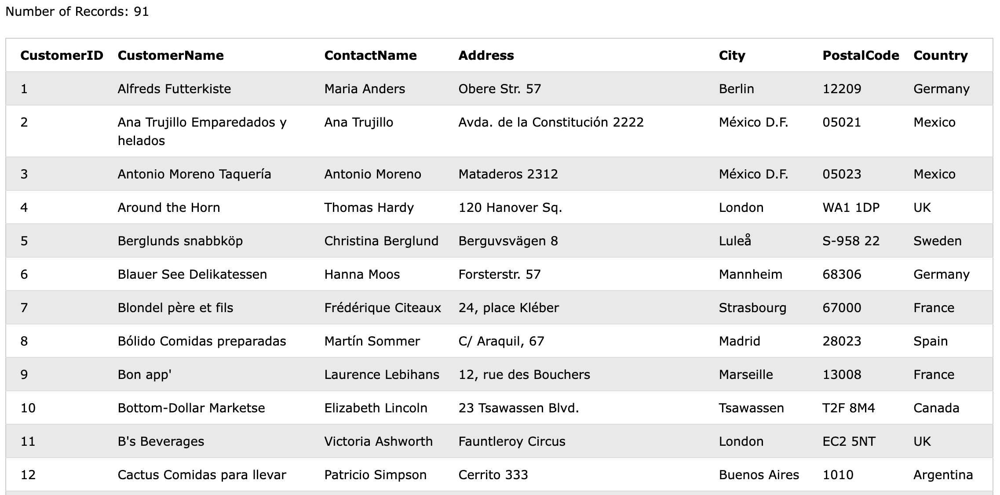

    - **Every table is broken up into smaller entities called fields.** The fields in the Customers table consist of CustomerID, CustomerName, ContactName, Address, City, PostalCode and Country. **A field is a column in a table that is designed to maintain specific information about every record in the table.**
    - **A record, also called a row, is each individual entry that exists in a table.** For example, there are 91 records in the above Customers table. A record is a horizontal entity in a table.

- To use a ==server-side scripting language==, like PHP or ASP

- To use ==SQL== to get the data you want

- To use ==HTML / CSS== to style the page


### 1.2 Syntax

#### 1.2.1 Database Tables

**A database most often contains one or more tables. Each table is identified by a name** (e.g. "Customers" or "Orders"). Tables contain records (rows) with data.

In this tutorial we will use the well-known Northwind sample database (included in MS Access and MS SQL Server).

Below is a selection from the "Customers" table:

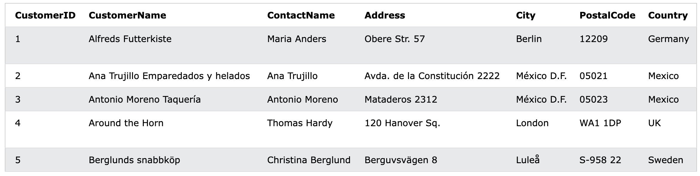

The table above contains five records (one for each customer) and seven columns (fields - CustomerID, CustomerName, ContactName, Address, City, PostalCode, and Country).


#### 1.2.2 SQL Statements

Most of the actions you need to perform on a database are done with **SQL statements.**

The following SQL statement selects all the records in the "Customers" table:

```sql
SELECT * FROM Customers;
```

> ⚠️Note: Keep in Mind That SQL keywords are **NOT case sensitive: `select` is the same as `SELECT`**


#### 1.2.3 Some of The Most Important SQL Commands

- `SELECT` - extracts data from a database
- `UPDATE` - updates data in a database
- `DELETE` - deletes data from a database
- `INSERT INTO` - inserts new data into a database
- `CREATE DATABASE` - creates a new database
- `ALTER DATABASE` - modifies a database
- `CREATE TABLE` - creates a new table
- `ALTER TABLE` - modifies a table
- `DROP TABLE` - deletes a table
- `CREATE INDEX` - creates an index (search key)
- `DROP INDEX` - deletes an index


### 1.3 Select Statement

#### 1.3.1 The SQL Select Statement

The **`SELECT` statement** is used to select data from a database.

==The data returned is stored in a result table, called the **result-set**.==

```sql
SELECT column1, column2, ...
FROM table_name;
```

Here, column1, column2, ... are the field names of the table you want to select data from. If you want to select all the fields available in the table, use the following syntax:

```sql
SELECT * FROM table_name;
```

> \* means all the fields in a table.

==*For Mysql, we can use key word **LIMIT** to constrain the number of data to display when we use \**==

```sql
SELECT * FROM Products LIMIT 5;
```


#### 1.3.2 The SQL Select Distinct Statement

**The `SELECT DISTINCT` statement is used to return only ==distinct (different) values==.**

Inside a table, a column often contains many duplicate values; and sometimes you only want to list the different (distinct) values.

The following SQL statement selects only the **DISTINCT** values from the "Country" column in the "Customers" table:

```sql
SELECT DISTINCT Country FROM Customers;
```

Also, we can add **more than one** DISTINCT condition. At this time, the "merge duplicate rule" will apply for **ALL** conditions:

`````sql
SELECT DISTINCT Name, Country FROM Customers;
`````

The following SQL statement lists **The Number of different (distinct)** customer countries:

````sql
SELECT COUNT(DISTINCT Country) FROM Customers;
````


⚠️NOTE: **The example above will not work in Firefox!** Because COUNT(DISTINCT *column_name*) is not supported in Microsoft Access databases. Firefox is using Microsoft Access in our examples.

Here is the workaround for MS Access:

```sql
SELECT Count(*) AS DistinctCountries
FROM (SELECT DISTINCT Country FROM Customers);
```


### 1.4 WHERE Clause

==The `WHERE` clause is used to filter records.==

It is used to extract only those records that fulfill a specified condition.

```sql
SELECT column1, column2, ...
FROM table_name
WHERE condition;
```

> ⚠️NOTE: The `WHERE` clause is not only used in `SELECT` statements, it is also used in `UPDATE`, `DELETE`, etc.!
>
> Also the position of **WHERE** should come after **From** and before **Order By**

The following SQL statement selects all the customers from the country "Mexico", in the "Customers" table:

```sql
SELECT * FROM Customers
WHERE Country = 'Mexico';
```

Some common WHERE clause operators:

| Operator    | Description                                                  | Example                                                      |
| :---------- | :----------------------------------------------------------- | :----------------------------------------------------------- |
| =           | Equal                                                        | [Try it](https://www.w3schools.com/sql/trysql.asp?filename=trysql_op_equal_to) |
| >           | Greater than                                                 | [Try it](https://www.w3schools.com/sql/trysql.asp?filename=trysql_op_greater_than) |
| <           | Less than                                                    | [Try it](https://www.w3schools.com/sql/trysql.asp?filename=trysql_op_less_than) |
| >=          | Greater than or equal                                        | [Try it](https://www.w3schools.com/sql/trysql.asp?filename=trysql_op_greater_than2) |
| <=          | Less than or equal                                           | [Try it](https://www.w3schools.com/sql/trysql.asp?filename=trysql_op_less_than2) |
| <>          | Not equal. ⚠️**Note:** In some versions of SQL this operator may be written as **!=** | [Try it](https://www.w3schools.com/sql/trysql.asp?filename=trysql_op_not_equal_to) |
| BETWEEN     | Between a certain range. ⚠️**Note:** **BETWEEN** is **inclusive** for the value range | [Try it](https://www.w3schools.com/sql/trysql.asp?filename=trysql_op_between) |
| LIKE        | Search for a pattern                                         | [Try it](https://www.w3schools.com/sql/trysql.asp?filename=trysql_op_like) |
| IN          | To specify multiple possible values for a column             |                                                              |
| ==IS NULL== | Is a null value                                              |                                                              |


#### 1.4.1 Text Fields vs Numeric Fields

==SQL requires single quotes around text values (most database systems will also allow double quotes). However, numeric fields should not be enclosed in quotes:==

```sql
SELECT * FROM Customers
WHERE CustomerID = 1;
```


#### 1.4.2 The AND, OR and NOT Operators

The `WHERE` clause can be combined with `AND`, `OR`, and `NOT` operators.

The `AND` and `OR` operators are used to filter records based on more than one condition:

- **The `AND` operator displays a record if all the conditions separated by `AND` are TRUE.**
- **The `OR` operator displays a record if any of the conditions separated by `OR` is TRUE.**

- **The `NOT` operator displays a record if the condition(s) is NOT TRUE.**

**⚠️Note: SQL processes AND operators before OR operators.**

1. The following SQL statement selects all fields from "Customers" where country is "Germany" AND city is "Berlin":

   ```sql
   SELECT * FROM Customers
   WHERE Country = 'Germany' AND City = 'Berlin';
   ```

2. The following SQL statement selects all fields from "Customers" where city is "Berlin" OR "München":

   ```sql
   SELECT * FROM Customers
   WHERE City='Berlin' OR City = 'München';
   ```

3. The following SQL statement selects all fields from "Customers" where country is NOT "Germany":

   ```sql
   SELECT * FROM Customers
   WHERE NOT Country='Germany';
   ```

4. The following SQL statement selects all fields from "Customers" where country is "Germany" AND city must be "Berlin" OR "München" (use parenthesis to form complex expressions):

   ```sql
   SELECT * FROM Customers
   WHERE Country='Germany' AND (City='Berlin' OR City='München');
   ```

   The following SQL statement selects all fields from "Customers" where country is NOT "Germany" and NOT "USA":

   ```sql
   SELECT * FROM Customers
   WHERE NOT Country ='Germany' AND NOT Country ='USA';
   ```


### 1.5 Order by Keyword and Order of Clause

**The `ORDER BY` keyword is used to sort the result-set in ==ascending== or descending order.**

> ⚠️NOTE：Position of ORDER BY Clause When specifying an ORDER BY clause, be sure that it is the **last clause** in your SELECT statement except **LIMIT** clause

**The `ORDER BY` keyword sorts the records in ascending order by default. To sort the records in ==descending== order, use the `DESC` keyword. To sort the records in ==ascending== order, use the `ASC` keyword.**

```sql
SELECT column1, column2, ...
FROM table_name
ORDER BY column1, column2, ... ASC|DESC;
```

The following SQL statement selects all customers from the "Customers" table, sorted by the "Country" column: **(alphabet sequence for string)**

```sql
SELECT * FROM Customers
ORDER BY Country;
```

The following SQL statement selects all customers from the "Customers" table, sorted DESCENDING by the "Country" column:

```sql
SELECT * FROM Customers
ORDER BY Country DESC;
```

**The following SQL statement selects all customers from the "Customers" table, sorted ascending by the "Country" and descending by the "CustomerName" column:**

```sql
SELECT * FROM Customers
ORDER BY Country ASC, CustomerName DESC;
```

> (Priority from **LEFT** to **RIGHT**)
>
> ⚠️NOTE: If want to sort descending on multiple columns, be sure **Each** column has its **Own** DESC keyword

ORDER BY also supports ordering specified by **relative column position**

```sql
 SELECT prod_id, prod_price, prod_name
 FROM Products
 ORDER BY 2, 3;
```

- The relative positions of selected columns in the SELECT list are specified. ORDER BY 2 means sort by the second column in the SELECT list, the prod_price column
- Obviously, you cannot use this technique when sorting by columns that are not in the SELECT list

==**⚠️NOTE: The order of processor read the SQL clause is like: WHERE... SELECT... ORDER BY...**==

==**在 SQL 查询中，以下是处理顺序：**==

1. ==**FROM: 从哪些表中检索数据。**==
2. ==**WHERE: 对于 FROM 子句返回的行，应用任何条件筛选器以排除不需要的行。**==
3. ==**SELECT: 对符合条件的数据进行选择。**==
4. ==**GROUP BY: 对结果进行分组。**==
5. ==**h: 对每个分组应用筛选器。**==
6. ==**ORDER BY: 对结果集进行排序。**==

这个顺序通常被称为查询处理的逻辑顺序。查询处理器首先执行FROM语句，它会找到表，并将它们连接起来。WHERE语句使用逻辑运算符和比较运算符对数据进行筛选，筛选出需要的行。然后，SELECT语句根据给定的列名生成一个结果集，GROUP BY子句将结果集分组，HAVING子句筛选出不需要的组，最后按照ORDER BY子句的要求对结果集进行排序并返回结果。


### 1.6 Insert Into Statement 

**The `INSERT INTO` statement is used to insert new records in a table.**

#### 1.6.1 INSERT INTO Syntax

It is possible to write the `INSERT INTO` statement in two ways:

1. ==Specify both the column names and the values to be inserted:==

   ```sql
   INSERT INTO table_name (column1, column2, column3, ...)
   VALUES (value1, value2, value3, ...);
   ```

2. ==If you are adding values for all the columns of the table, you do not need to specify the column names in the SQL query.== However, make sure the order of the values is in the same order as the columns in the table. Here, the `INSERT INTO` syntax would be as follows:

   ```sql
   INSERT INTO table_name
   VALUES (value1, value2, value3, ...);
   ```

   > **Corresponding to each column**


### 1.7 IN Clause

Advanced Data Filtering

Using the IN Operator - used to specify a range of conditions, any of which can be matched.
IN takes a comma-delimited list of valid values, all enclosed within parentheses.

```sql
SELECT prod_name, prod_price, vend_id 
FROM Products
WHERE vend_id IN ('DLL01','BRS01');
```


### 1.8 Wildcard

- Wildcard - Special characters used to match parts of a value

- Using the LIKE Operator - To use wildcards in search clauses, the LIKE operator

  must be used

- Wildcard searching can **only be used with text fields (strings)**, you can’t use

  wildcards to search fields of non-text datatypes

#### **1.8.1 The Percent Sign (%) Wildcard** 

Percent Sign (%)  – most frequently used wildcard -  means, ==**match any number of occurrences of any character**==

```sql
SELECT prod_id, prod_name FROM Products
WHERE prod_name LIKE 'Fish%';
SELECT prod_id, prod_name
FROM Products
WHERE prod_name LIKE '%bean bag%';
```

#### **1.8.2 The Underscore (_) Wildcard** 

Underscore (_) Wildcard – match a ==**single**== character

```sql
SELECT prod_id, prod_name
 FROM Products
 WHERE prod_name LIKE '__ inch teddy bear';

SELECT prod_id, prod_name
 FROM Products
 WHERE prod_name LIKE '% inch teddy bear';
```


### 1.9 Calculated Field

- Sometimes, the data stored in the table is not exactly what your application needs
- Rather than retrieve the data as it is, what you really want is to retrieve **converted, calculated, or reformatted data** directly from the database
- Calculated fields don’t actually exist in database tables. Rather, a calculated field is created on-the-fly **within a SQL SELECT statement**

#### **1.9.1 Concatenating Fields**

Concatenating Fields - Joining values together (by appending them to each other) to form a single long value.

• MySQL uses CONCAT() to concatenate strings:

```sql
SELECT concat(vend_name, ' (' ,vend_country, ')') FROM Vendors
ORDER BY vend_name;
```

Use Aliases to name the new calculated column (NO SPACE for alias)

```SQL
SELECT Concat(vend_name, ' (', vend_country, ')') AS vend_title
FROM Vendors
ORDER BY vend_name;
```

#### **1.9.2 Performing Mathematical Calculations**

Another frequent use for calculated fields is performing mathematical calculations on retrieved data.

```sql
SELECT prod_id, quantity, item_price, quantity * item_price AS total_sales 
FROM OrderItems
WHERE order_num = 20008;
```

SQL Mathematical Operators: + - * /


### 1.10 Function

• Functions perform calculations **on columns!**

• Unlike SQL statements, which for the most part are supported by all DBMSs equally, functions tend to be very DBMS(database management system) specific: 

• DBMS Function Differences:


#### **1.10.1 String functions** 

String functions are used to manipulate strings of text; for example, trimming or padding values and **converting values to upper and lowercase**

##### 1.10.1.1 Substring()

```sql
# SUBSTRING (name, pos, len) -> position counts from 1
SELECT vend_name, SUBSTRING (vend_name,1,4) AS first_4_letters_of_vend_name FROM Vendors ORDER BY vend_name;
```


##### 1.10.1.2 UPPER()/LOWER()

```sql
SELECT vend_name, UPPER (vend_name) AS vend_name_uppercase FROM Vendors ORDER BY vend_name;
```


#### **1.10.2 Date and time function**

Date and time functions are used to manipulate date and time values and to extract specific components from these values; for example, extracting date part from a date value, and checking date validity:

````sql
SELECT order_num
FROM Orders
WHERE YEAR(order_date) = 2012;

# NOW() -> date and time
SELECT order_num, order_date, 
NOW() as currentdateandtime 
FROM Orders;

# curdate -> date only, DATEDIFF -> pre time - last time (unit: days)
SELECT order_num, order_date, NOW() as currentdateandtime, curdate() as current_dt, DATEDIFF(curdate(),
order_date) as dategap
FROM Orders;
````


#### **1.10.3 CASE expression**

CASE expression is a very commonly used control flow function

- CASE expression can be used to conditionally enter into some logic based on the

  status of a condition being satisfied

- It is usually used to create a new column

- It is better to make sure each condition is mutually exclusive

  CASE WHEN [value=compare_value] THEN result 

  [WHEN [value=compare_value] THEN result ...]

  [ELSE result] END (AS new_column)

  ```sql
  SELECT prod_price,
  case when prod_price < 6 then 'low price' 
  else 'high price' end 
  from products;
  ```


#### **1.10.4 Aggregate Function**

Examples of Aggregate Functions usages:

- Determining the number of rows in a table (or the number of rows that meet

  some condition or contain a specific value)

- Obtaining the sum of a set of rows in a table.

- Finding the highest, lowest, and average values in a table column (either for all

  rows or for specific rows)

- Aggregate Functions - Functions that operate on a set of rows to calculate and return a single value:	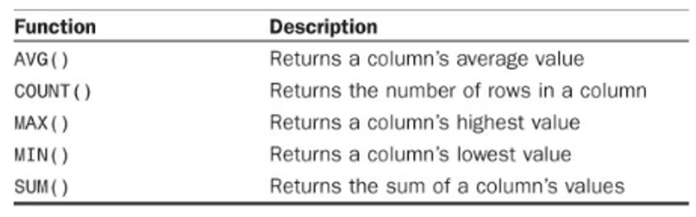

The five aggregate functions can all be used in two ways:

- To perform calculations on all rows, specify the ALL argument (*) or specify no

  argument at all (because ALL is the default behavior)

- To only include unique values, specify the **DISTINCT** argument

  ```sql
  #Check the number of DIFFERENT prices
  SELECT count(DISTINCT prod_price) AS count_price FROM Products
  WHERE vend_id = 'DLL01';
  ```

- DISTINCT may only be used with COUNT() if a column name is specified. DISTINCT may not be used with COUNT(*)
- Most of time, DISTINCT is used together with Count()


##### **1.10.4.1 AVG() Function**

The AVG() Functioncan be used to return the average value of any column:

````sql
SELECT AVG(prod_price) AS avg_price
FROM Products;
````

AVG() can also be used to determine the average value of specific columns or rows:

```sql
SELECT AVG(prod_price) AS avg_price 
FROM Products
WHERE vend_id = 'DLL01';
```

> ⚠️Note: 
>
> - AVG() only be used on an individual Column
>
> - Column rows containing NULL values are ignored by the AVG() function

##### **1.10.4.2 COUNT() Function **

The COUNT() Function can determine the number of rows in a table or the number of rows that match a specific criterion

• Use **COUNT(\*)** to count the number of rows in a table, **whether columns contain values or NULL values:**

```sql
SELECT COUNT(*) AS num_cust FROM Customers;
```

==Column rows with NULL values are ignored by the COUNT() function **if a column name is specified**, but not if the asterisk (*) is used.==

• Use **COUNT(column)** to count the number of rows that have values in a specific column, **ignoring NULL values:**

```sql
SELECT COUNT(cust_email) AS num_cust
```

##### **1.10.4.3 MAX()/Min() Function**

The MAX() Function returns the highest value in a specified column

```sql
SELECT MAX(prod_price) AS max_price FROM Products;
```

The MIN() Function returns the lowest value in a specified column

```sql
SELECT MIN(prod_price) AS min_price FROM Products;
```

==Column rows with NULL values in them are ignored by the MAX() and MIN() function==

##### 1.10.4.4 SUM() function

The SUM() Function - to return the sum (total) of the values in a specific column

````sql
SELECT SUM(quantity) AS items_ordered
FROM OrderItems
WHERE order_num = 20005;
````

SUM() can also be used to **calculated values**:

```sql
SELECT SUM(item_price * quantity) AS total_sales
FROM OrderItems
WHERE order_num = 20005;
```

- ==All the aggregate functions can be used to perform calculations on multiple columns using the standard mathematical operators, as shown in the example==
- ==Column rows with NULL values in them are ignored by the SUM() function==


### 1.11 Groups

#### 1.11.1 Gourp By

Groups are created using the **GROUP BY** clause is your select statement 

```sql
# With Group By, the Count() aggregates the number of records for each unique vend_id
SELECT vend_id,
COUNT(*) AS num_prod ,
AVG(prod_price) as avg_price FROM Products
GROUP BY vend_id
ORDER by num_prods;
```

Result: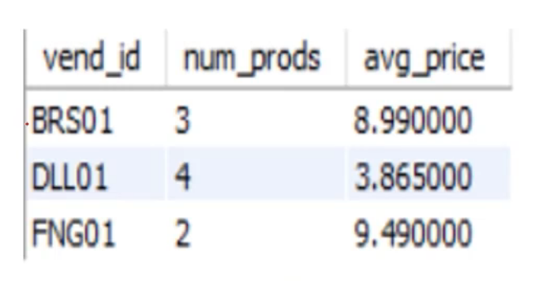

Sometimes, we call **non-aggregated** columns as segmentation variables

````sql
SELECT order_num,prod_id, 
sum(quantity)
FROM orderitems
GROUP BY order_num,prod_id;
````

⚠️Note: 

1. Those non-aggregated columns 是分级的，order_num 为第一级，prod_id 为第二级
2. **You can have more than one non- aggregated columns in SELECT statement, but make sure they are ALSO in Group BY clause**
3. If the grouping column contains a row with a NULL value, NULL will be returned as a group. If there are multiple rows with NULL values, they’ll all be grouped together
4. The GROUP BY clause must **come after any WHERE clause and before any ORDER BY clause**
5. 在 SQL 中，SELECT 语句和 GROUP BY 语句是独立的部分，它们的顺序不应该影响查询结果。但是，如果 SELECT 中的列的顺序与 GROUP BY 中的列的顺序不同，查询结果可能会按照 GROUP BY 中的列的顺序进行排序，而不是按照 SELECT 中的列的顺序进行排序。这是因为 GROUP BY 子句是按照指定的列对结果进行分组，因此结果集将按照这些列的值进行排序。


#### 1.11.2 Having

To **filter** Groups, you have to use **HAVING** clause, instead of **WHERE** clause

==having和where的区别:==

1. WHERE 关键字用于筛选行，通常在执行 GROUP BY 子句之前使用。WHERE 子句中的条件过滤掉不需要的行，只保留符合条件的行。WHERE 关键字使用的是标准的比较运算符，如等于、大于、小于等。
2. HAVING 关键字用于筛选组，在执行 GROUP BY 子句之后使用。HAVING 子句中的条件过滤掉不需要的组，只保留符合条件的组。HAVING 关键字使用的是聚合函数，如 SUM、COUNT、AVG 等。因为 HAVING 是在 GROUP BY 之后进行筛选的，所以它可以使用 GROUP BY 子句中定义的别名或者聚合函数。

```sql
SELECT cust_id, COUNT(*) AS orders 
FROM Orders
GROUP BY cust_id
HAVING COUNT(*) >= 2;
```

We can use them together: WHERE filters before data is grouped, and HAVING filters after data is grouped

```sql
SELECT vend_id, COUNT(*) AS num_prods 
FROM Products
WHERE prod_price >= 4
GROUP BY vend_id
HAVING COUNT(*) >= 2;
```

- ==**Rows that are eliminated by a WHERE clause will not be included in the group**==
- ==**Use HAVING only in conjunction with GROUP BY clauses.**==
- ==**Use WHERE for standard row-level filtering**==


### 1.12 CASE

**`CASE`** 语句在 SQL 中是一种条件表达式，类似于编程语言中的 `if-else`，用于根据条件返回不同的结果。它在 `SELECT`、`UPDATE`、`INSERT` 和 `DELETE` 语句中都可以使用，用来处理复杂的条件判断。

````sql
SELECT column_name,
       CASE
           WHEN condition1 THEN result1
           WHEN condition2 THEN result2
           ELSE resultN
       END AS alias_name
FROM table_name;
````

**语法说明：**

- **`CASE`**：表示开始条件判断。
- **`WHEN condition THEN result`**：如果 `condition` 为真，则返回 `result`。你可以写多个 `WHEN` 条件。
- **`ELSE`**：当所有的 `WHEN` 条件都不成立时，返回 `ELSE` 后的值。`ELSE` 是可选的。
- **`END`**：表示 `CASE` 语句的结束。
- **`AS alias_name`**：为返回的结果列指定一个别名。


## 2. Advanced

### 2.1 Subqueries

#### 2.1.1 Understand Subqueries

SQL also enables you to create subqueries - queries that are **embedded** into other queries

**Example: Now suppose you wanted a list of all the customers who ordered item RGAN01:**

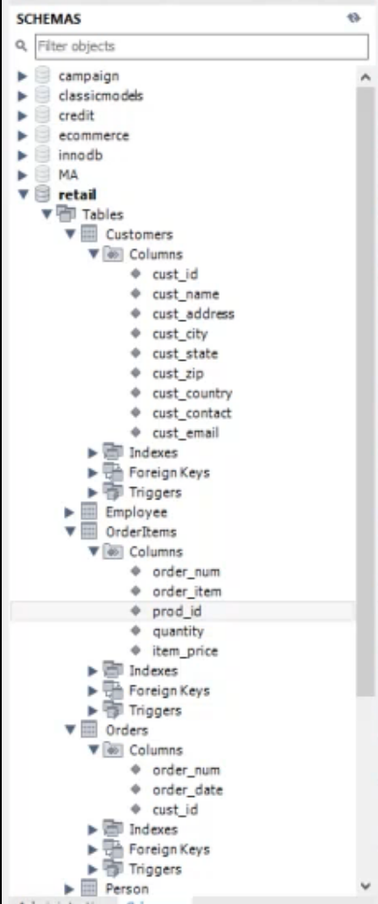

1. Retrieve the order numbers of all orders containing item RGAN01

```sql
SELECT order_num
FROM OrderItems
WHERE prod_id = 'RGAN01’;
```

2. Retrieve the customer ID of all the customers who have orders listed in the order numbers returned in the previous step

```sql
SELECT cust_id
FROM Orders
WHERE order_num IN (20007,20008);
```

3. Retrieve the customer information for all the customer IDs returned in the previous step

```sql
SELECT cust_name, cust_contact
FROM Customers
WHERE cust_id IN ('1000000004','1000000005');
```

**However, we can use subqueries to embed SELECT clause:**

````sql
SELECT cust_name, cust_contact FROM Customers
WHERE cust_id IN (SELECT cust_id
									FROM Orders
									WHERE order_num IN (SELECT order_num FROM OrderItems
																			WHERE prod_id = 'RGAN01'));
````

**==⚠️Note: 输出列格式要等于输入列格式，Subquery SELECT statements can only retrieve a single column. Attempting to retrieve multiple columns will return an error==**


### 2.2 Join Tables

**A join is a mechanism used to associate tables within a SELECT statement**

**JOIN是用于在两个或多个表中根据它们之间的关系组合数据的操作。==JOIN操作允许通过将一列或多列值（也称为关键列）与另一个表中的列进行比较，从而将两个或多个表中的行组合起来。==JOIN是SQL中非常重要的操作之一，它允许从多个表中检索数据，同时允许在这些表之间建立关系，从而使得查询结果更加丰富和有用。**

```sql
SELECT vend_name, prod_name, prod_price 
FROM Vendors, Products
WHERE Vendors.vend_id = Products.vend_id;
```

You also need **Join Condition** to tell the database how to join – in this example, the WHERE clause acts as a filter to only include rows that match the specified filter condition

Without **Join Condition**, **Cartesian Product** will be generated - The number of rows retrieved will be the number of rows in the first table multiplied by the number of rows in the second table

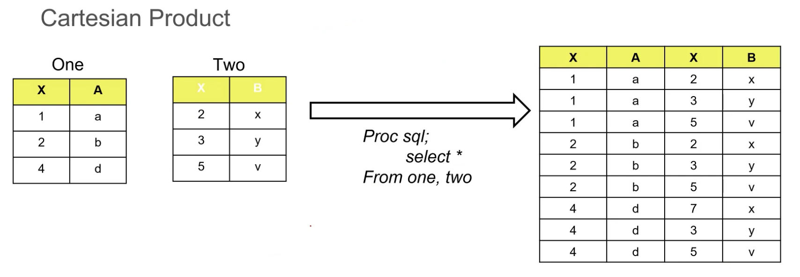

*The number of rows in the Cartesian product of tables One and Two **= 3 x 3 = 9***

**==Must use the fully qualified column name (table and column separated by a period) whenever there is a possible ambiguity about which column are referring to==**

==**In all types of joins, SQL generates a Cartesian Product first, and then eliminates rows that do not meet any subsettting criteria that you have specified!**==


#### 2.2.1 Inner Join

**Inner Join - Only returns the rows that match across all tables**

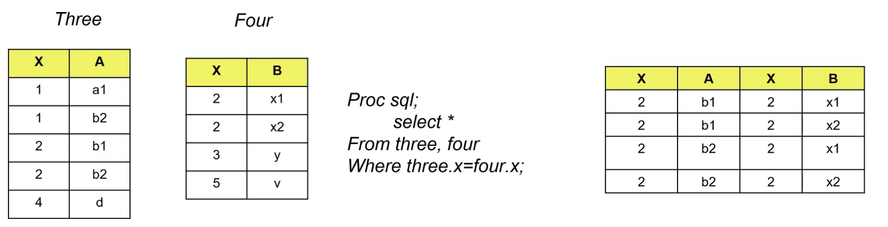

The number of rows in the Cartesian product of tables One and Two **= 5 x 4 = 20 **

**==Inner Join has 2 different syntaxes:==** 

```sql
SELECT vend_name, prod_name, prod_price
FROM Vendors, Products
WHERE Vendors.vend_id = Products.vend_id;
```

**A different one:**

```sql
SELECT vend_name, prod_name, prod_price 
FROM Vendors (INNER) JOIN Products
ON Vendors.vend_id = Products.vend_id;
```

如果想再加别的条件筛选，可以在ON后面再加WHERE进行添加


#### **2.2.2 Join Multiple Tables**

SQL imposes no limit to the number of tables that may be joined in a SELECT statement.

```sql
SELECT prod_name, vend_name, prod_price, quantity 
FROM OrderItems, Products, Vendors
WHERE Products.vend_id = Vendors.vend_id
AND OrderItems.prod_id = Products.prod_id
AND order_num = 20007;
```

Join 的顺序不重要，能连起来就行

Be careful not to join tables unnecessarily. The more tables you join the more performance will degrade

Let us revisit the example from last class

Now suppose you wanted the information (e.g. customer name, contact) of all the **customers who ordered item RGAN01**

```sql
SELECT cust_name, cust_contact 
FROM Customers
WHERE cust_id IN (SELECT cust_id
									FROM Orders
 									WHERE order_num IN (SELECT order_num FROM OrderItems
                                      WHERE prod_id = 'RGAN01'));
```

Using Joins is **more efficient** than subqueries:

````sql
SELECT cust_name, cust_contact
FROM Customers, Orders, OrderItems
WHERE prod_id = 'RGAN01' 
AND Customers.cust_id = Orders.cust_id
AND Orders.order_num = OrderItems.order_num;
````

**A different way:**   

````sql
SELECT cust_name, cust_contact
FROM Customers join Orders on Customers.cust_id = Orders.cust_id
join OrderItems on OrderItems.order_num = Orders.order_num
WHERE prod_id = 'RGAN01';
````


#### 2.2.3 Table Aliases

In addition to using aliases for column names and calculated fields, SQL also enables you to **alias** table names. There are two primary reasons to do this:

- **To shorten the SQL syntax**
- **To enable multiple uses of the same table within a single SELECT statement**

```sql
SELECT C.cust_name, C.cust_contact as customer_contact 
FROM Customers AS C, Orders AS O, OrderItems AS OI 
WHERE C.cust_id = O.cust_id
AND OI.order_num = O.order_num
AND prod_id = 'RGAN01';
```

==⚠️Note:==

1. ==对于存在于**多个** Table 中的 Column 要在 SELECT 阶段附加特定的 Table 名称，如: C.cust_id. 这里 C 指代的是 Alias 之后的 Table 名字。**特别需要注意的是，一旦对 Table 名进行了重命名，则必须使用重命名之后的简称，使用原来的全称会报错！！！因为 SQL 对于 Clause 的处理顺序 FROM 排在第一位！**==
2. ==**Cartesian Product / Join** 将会在 WHERE 语句处理前生成。==


#### 2.2.4 Outer Join

**Outer Joins - the join includes table rows that have no associated rows in the related table**

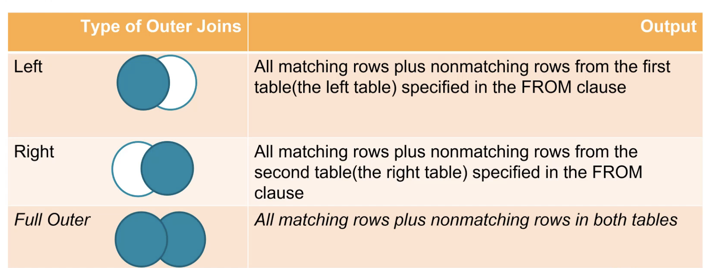

The following SELECT statement is a simple inner join. It retrieves a list of all customers and their orders:

```sql
SELECT Customers.cust_id, Orders.order_num 
FROM Customers INNER JOIN Orders ON Customers.cust_id = Orders.cust_id;
```

Outer join syntax is similar. To retrieve a list of all **customers including those who have placed no orders, you can do the following:**

```sql
SELECT Customers.cust_id, Orders.order_num 
FROM Customers LEFT (OUTER) JOIN Orders ON Customers.cust_id = Orders.cust
```

**==⚠️Note: For Outer Join syntax, we can not use WHERE clause to deploy it. It only works for Inner Join==**

**==LEFT 前面的为主表，RIGHT 后面的为主表==**


##### 2.2.4.1 Left Join

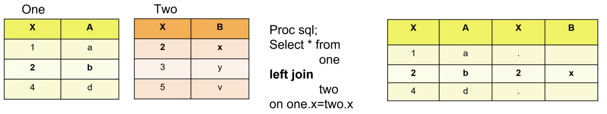

**==A right outer join can be turned into a left outer join simply by reversing the order of the tables in the FROM clause==**

**Can still use WHERE clause after ON condition to do filterin**

多个 LEFT JOIN 一起使用时，**主表是共同的**，只是在多次添加副表。

````sql
SELECT C.cust_id,cust_name, cust_contact
FROM Customers AS C 
LEFT JOIN Orders AS O ON C.cust_id = O.cust_id
LEFT JOIN OrderItems AS OI ON OI.order_num = O.order_num
where prod_id = 'RGAN01';
````


##### 2.2.4.2 Right Join

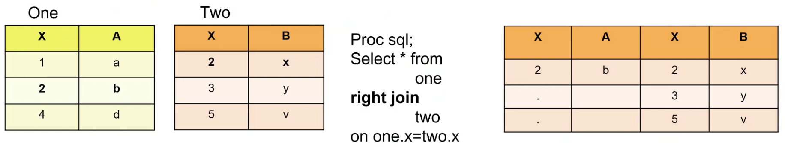

##### 2.2.4.3 Full Outer Join

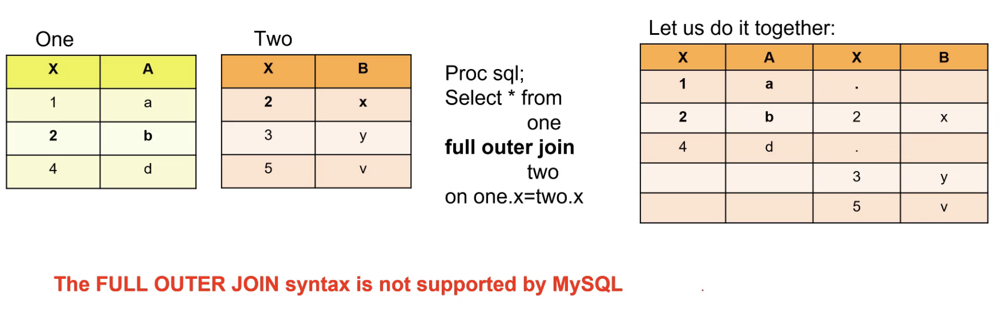


#### 2.2.5 Use Joins with Aggregate Functions

**Aggregate functions can be used with JOIN**

Let us retrieve a list of all customers and the number of orders that each has placed

**There are two ways to implement:**

```sql
SELECT Customers.cust_id, COUNT(Orders.order_num) AS num_ord 
FROM Customers INNER JOIN Orders ON Customers.cust_id = Orders.cust_id 
GROUP BY Customers.cust_id;
```

这个表只会返回那些有过订单的顾客，而不显示没有订单的顾客，与实际不符。

```sql
SELECT Customers.cust_id, COUNT(Orders.order_num) AS num_ord 
FROM Customers LEFT OUTER JOIN Orders ON Customers.cust_id = Orders.cust_id 
GROUP BY Customers.cust_id;
```

这个表会显示所有的顾客，并将没有订单的顾客订单数显示为0，与实际相符，应使用。

**此外要注意！不可以使用 Count（*），否则 NULL 也会被计算为订单数。**


#### 2.2.6 USING

If the join condition uses the ==**equality operator (=) and the column names in both tables used for matching are the same**==, then can use the USING *clause*

````sql
SELECT salesRepEmployeeNumber as employeeNumber,
SUM(quantityOrdered * priceEach) sales FROM
orders
INNER JOIN
orderdetails USING (orderNumber) 
INNER JOIN
customers USING (customerNumber) 
WHERE YEAR(shippedDate) = 2003 AND status = 'Shipped'
GROUP BY salesRepEmployeeNumber ORDER BY sales DESC
LIMIT 5
````


#### 2.2.7 Thinking About Join Operation 

如果A表有100条，B表有50条，A LEFT JOIN B 结果是 >= 100 条，而不是100条


==对于A表中的任一行，如果B表中有**多行**与其相匹配，则每一行符合条件的B表语句都对应于A表中的**一行**语句==


### 2.3 Combine Queries

#### 2.3.1 Union

There are basically two scenarios in which you’d use union queries:

- **To return similarly structured data from different tables in a single query**
- **To perform multiple queries against a single table returning the data as one query**

Using UNION is simple enough. All you do is specify each SELECT statement and place the keyword UNION between each

For example, you need a report on all your customers in Illinois, Indiana, and Michigan. You also want to include all Fun4ALL locations, regardless of state:

```sql
select cust_name, cust_contact, cust_email
from customers where cust_state in ('IL', 'IN','MI')
UNION
select cust_name, cust_contact, cust_email
from customers where cust_name = 'Fun4All';
```

==**⚠️Note: When combining queries with a UNION only one Order BY can be used. It must occur after the final SELECT statement.**==


#### 2.3.2 Union ALL

**==The UNION automatically removes any duplicate rows from the query result set==** – this is the default behavior of UNION. **Use UNION ALL to include all occurrences of all matches**

```sql
select cust_name, cust_contact, cust_email 
from customerswhere cust_state in ('IL','IN','MI') 
UNION ALL
select cust_name, cust_contact, cust_email
from customerswhere cust_name = 'Fun4All'
```


### 2.4 Insert Data

Insert is used to insert rows to a database table and it can be used in several ways:

- **Insert a single complete row**
- **Insert a single partial row**
- **Insert the result of a query (最常见)** 

```sql
INSERT INTO customers
VALUES
('1000000006','Toy Land','123 Any Street', 'New York','NY','11111','USA',NULL,NULL);
```

**The ==safer way== to write the INSERT statement is as follows:**

```sql
INSERT INTO customers (cust_id,cust_name,cust_address,cust_city,cust_state,cust_zip,cust_country,cust_contact,cust_email) 
VALUES
('1000000007','Toy Land','123 Any Street’, 'New York','NY','11111','USA',NULL,NULL);
```


#### 2.4.1 Insert Retrieved Data

```sql
INSERT INTO customers
(cust_id,cust_name,cust_address,cust_city,cust_state,cust_zip,cust_country,cust_contact,cust_email)

SELECT cust_id,cust_name,cust_address,cust_city,cust_state,cust_zip,cust_country,cust_contact,cust_email 
FROM CustNew;
```


### 2.5 Update Data

To update (modify) data in a table the UPDATE statement is used. UPDATE can be used in two ways:

- **To update specific rows in a table**
- **To update all rows in a table**

```sql
UPDATE customers <-- Table名
SET cust_email = 'kim@gmail.com' 
WHERE cust_id = '1000000005';
```

- Without WHERE clause, the database will ==update all rows== – be careful!
- Update multiple columns:

```sql
UPDATE customers
SET cust_email = 'kim@gmail.com', cust_contact = 'Sam Roberts' 
WHERE cust_id = '1000000005';
```


### 2.6 Delete Data

**To delete (remove) data** in a table the DELETE statement is used. DELETE can be used in two ways:

- **To delete specific rows from a table**
- **To delete all rows from a table**

```sql
DELETE FROM customers WHERE cust_id = '1000000005’;
```

- The DELETE statement deletes rows from the table, but **never deletes the table itself**
- ==If you omit the WHERE clause, the DELETE will delete every row==


### 2.7 Create Table

==You can create one table from another by adding a SELECT statement at the end of the CREATE TABLE statement:==

```sql
CREATE TABLE new_c (AS)
SELECT * FROM customers;
```

- **AS 可省略**
- **Table 名字中不应该有空格 **

​         

### 2.8 Drop Table

- **DROP TABLE removes one or more tables. You must have the DROP privilege for each table**
- **Be careful with this statement! It removes the table definition and all table data**

```sql
DROP TABLE new_c;
```

- Use **IF EXISTS** to prevent an error from occurring for tables that do not exist 

```sql
DROP TABLE IF EXISTS new_c;
```


### 2.9 Derived Table

A derived table is an expression that generates a table within the scope of a query FROM clause . For example, **a subquery in a SELECT statement FROM clause is a derived table**:

```sql
SELECT a.vend_id, b.vend_city FROM
		  (SELECT vend_id, COUNT(*) AS num_prods
							FROM Products WHERE prod_price >= 4
       				GROUP BY vend_id
       				Order by num_prods
       				Having num_prods >=2
       ) AS A 
			LEFT JOIN vendors as B on a.vend_id=b.vend_id;
```

==**• The [AS] table_name clause is mandatory because every table in a FROM clause must have a name**==


### 2.10 Window Functions

MySQL **8.0.2** introduces **SQL window functions**, or **analytic functions** as they are also sometimes called

Similar to Group By aggregation, window functions perform some calculation on a set of rows, e.g. COUNT or SUM;

However:

- **Group By aggregation collapses query rows in a single result row**
- **A window function produces a result for each query row**

The general syntax:

```sql
WINDOW_FUNCTION_NAME(expression) OVER (
		[PARTITION_DEFINTION] [ORDER_DEFINITION]
		)      
```

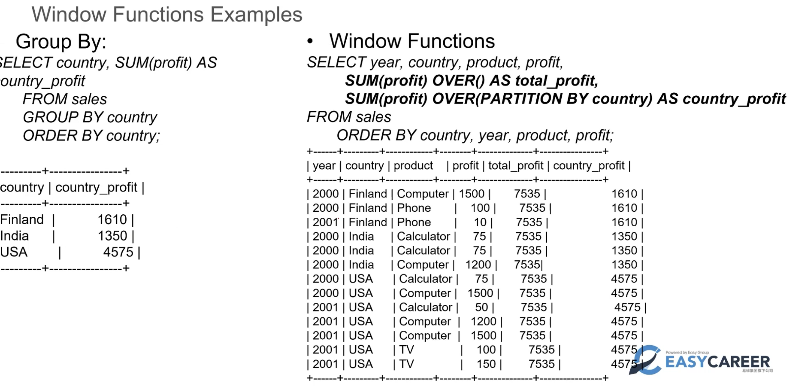

1. 可以看到，**OVER()** 就是对所有行都进行 FUNCITON 操作，如果括号里特别指明了 query rows 则按照指定条件进行Function操作
2. **PARTITION BY...** 的含义是 对Partition row ... 进行操作。**The function produces this sum for each partition row**


#### 2.10.1 row_number () Function

==**• Note that window functions are performed on the result set after all JOIN, WHERE, GROUP BY, and HAVING clauses and before the ORDER BY**==

**• The most commonly used Window Functions: ROW_NUMBER()**

**==Returns the number of the current row within its partition. Rows numbers range from 1 to the number of partition rows==**

```sql
SELECT id, name, 
ROW_NUMBER() OVER (PARTITION BY id, name ORDER BY name desc) AS row_num 
FROM t;
```

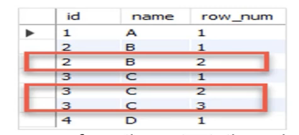

这里 ```PARTITION BY id, name``` 的意思是我们**将每一个 id 和 name 的组合看成一项**并对其进行排序。

==As you can see from the output, the unique rows are the ones whose the row number equals one. Then, you can use *row_num=1* to **dedupe**==

比如：

````sql
Select * 
from 
	(SELECT id, name,
	ROW_NUMBER() OVER (PARTITION BY id, name ORDER BY name desc) AS row_num FROM t) 
	as a 
where a.row_num =1
````


**Example:**

• Use **row_number()** function to only output the **most recent order** for each customer ID in table Orders ; the output should look like this:

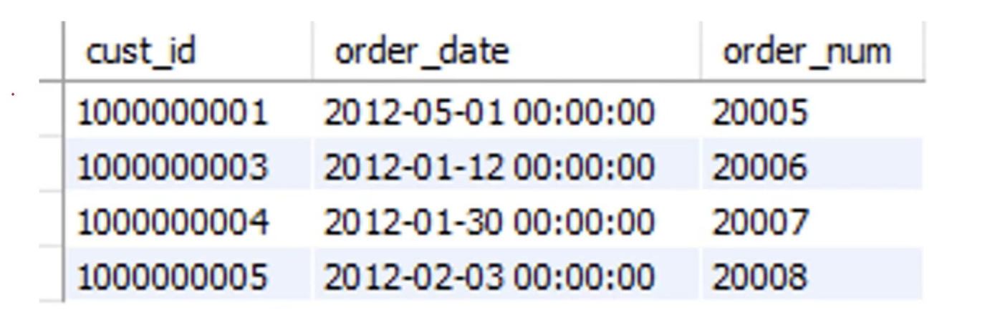

````sql
SELECT cust_id, order_date, order_num
FROM 
		(SELECT cust_id, order_date, order_num, ROW_NUMBER() OVER (PARTITION BY cust_id Order BY 		 order_date DESC) as row_num
    FROM retail.Orders
    ) AS a
WHERE a.row_num = 1;
````


## 3. Improved

### 3.1 CET (common table experssion) -- After version 8.0

**What is a common table expression (CTE)?**

A common table expression is ==**a named temporary result table that exists only within the execution scope of a single SQL statement e.g., SELECT, INSERT, UPDATE, or DELETE.**== 

在SQL中，CTE（Common Table Expression）是一种临时表，它在查询中被定义，并且**只在查询语句的生命周期中存在**。查询结束指的是查询语句的执行完成并返回结果集之后的状态。在查询结束之后，数据库管理系统会释放相应的系统资源和锁，并将结果集返回给客户端或应用程序

➢ **Like a derive table, a CTE is not stored**
➢ **Unlike a derive table, a CTE can be self-referencing; also, CTE has a better performance than derive tables** 

**The general syntax:**

```sql
WITH cte_name (column_list) AS ( 
query
)
SELECT * FROM cte_name;
```

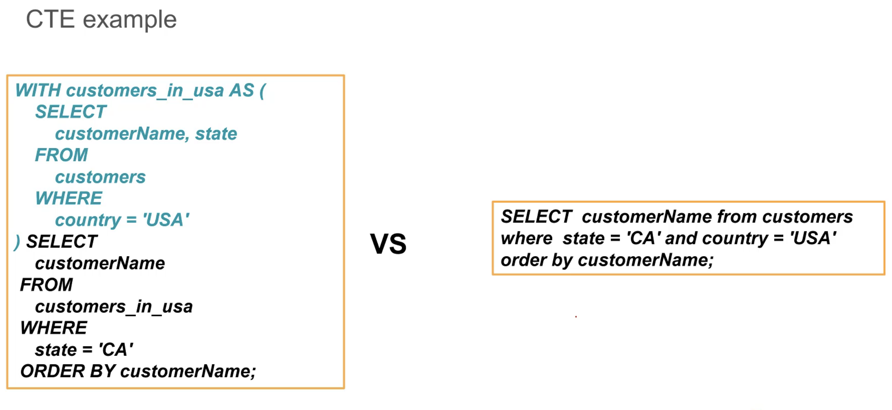

**此外，同一个 with 后可接多个 CTE，用逗号隔开即可**

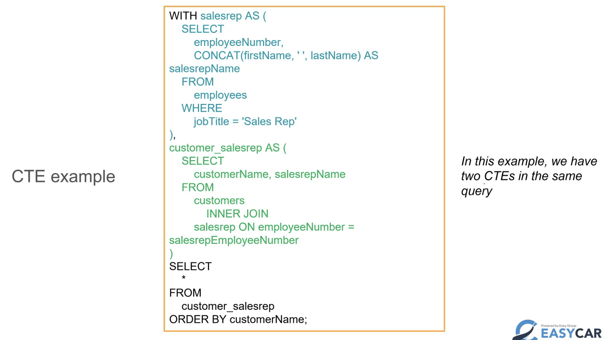


### 3.2 Recursive CTE

==**A recursive common table expression (CTE) is a CTE that has a subquery which refers to the CTE name itself**==

Recursion: the process in which a function calls itself directly or indirectly is called recursion and the corresponding function is called as recursive function.

**A recursive CTE consists of three main parts:**

1. ***An initial query that forms the base result set of the CTE structure. The initial query part is referred to as an anchor member. 第一个子查询称作定点（Anchor）子查询：定点查询只是一个返回有效表的查询，用于设置递归的初始值；***
2. ***A recursive query part is a query that references to the CTE name; therefore, it is called a recursive member. The recursive member is joined with the anchor member by a UNION ALL or UNION DISTINCT operator. 第二个子查询称作递归子查询：该子查询调用CTE名称，触发递归查询，实际上是递归子查询调用递归子查询；两个子查询使用union all，求并集***
3. ***A termination condition that ensures the recursion stops when the recursive member returns no row. 递归查询没有显式的递归终止条件，只有当递归子查询返回空结果集（没有数据行返回）或是超出了递归次数的最大限制时，才停止递归。***

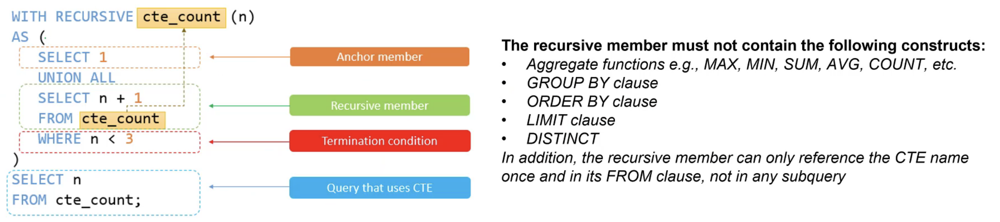


**==递归cte的语法格式是不是特定的？==**

是的，递归CTE的语法格式是特定的。以下是递归CTE的基本语法格式：

```sql 
WITH RECURSIVE cte_name (column_list)
AS (
    initial_query
    UNION ALL
    recursive_query
)
SELECT column_list FROM cte_name;
```

其中：

- `cte_name`：递归CTE的名称，可以自定义。
- `column_list`：递归CTE返回结果的列名列表。
- `initial_query`：递归CTE的初始查询语句，用于生成递归查询的起点。
- `recursive_query`：==**递归查询语句，用于生成递归查询的下一级结果！！！！**==
- `UNION ALL`：递归CTE的关键字，用于将初始查询和递归查询结果合并。
- `SELECT`：最终查询语句，用于从递归CTE中检索数据。

需要注意的是，递归CTE的`initial_query`和`recursive_query`必须具有相同的列数、名称和数据类型。此外，在递归CTE中，初始查询必须返回一组初始行，而递归查询必须使用初始行生成下一级行，直到递归过程结束。


### 3.3 **Stored Procedures**

By definition, a stored procedure is a segment of declarative SQL statements stored inside the MySQL Server for execution later. **Once you save the stored procedure, you can invoke it by using the CALL statement**

➢ A stored procedure can **have parameters** so you can pass values to it and get the result back

➢ A stored procedure may contain control flow statements such as IF, CASE, and LOOP that allow you to implement the code in the procedural way

➢ A stored procedure can call other stored procedures or stored functions

**Basic syntax of the CREATE PROCEDURE statement:**

````sql
CREATE PROCEDURE procedure_name(parameter_list) 
BEGIN
	statements;
END //
````

````sql
CALL stored_procedure_name(argument_list);
````

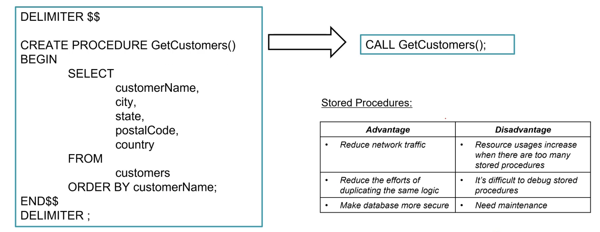

1. **To create a new stored procedure, you use the CREATE PROCEDURE statement**
2. ==**Execute the statements, MySQL will create the stored procedure and save it in the server.**==


#### 3.3.1 Delimiter

Usually, we uses the delimiter (;) to separate statements and executes each statement separately; However, **typically, a stored procedure contains multiple statements separated by semicolons (;)**

**To compile the whole stored procedure as a single compound statement, you need to temporarily change the delimiter from the semicolon (;) to another delimiter such as $$ or //:**

````sql
DELIMITER $$
CREATE PROCEDURE sp_name() 
BEGIN
-- statements 
END $$
DELIMITER ;
````

- First, change the default delimiter to $$.
- Second, use (;) in the body of the stored procedure and $$ after the END keyword to end the stored procedure.
- Third, change the default delimiter back to a semicolon (;)


#### 3.3.2 Drop Procedures

The **DROP PROCEDURE** statement deletes a stored procedure created by the CREATE PROCEDURE statement

```sql
Drop PROCEDURE [IF EXISTS] stored_procedure_name;
```

**• use IF EXISTS option to conditionally drop the stored procedure if it exists**

