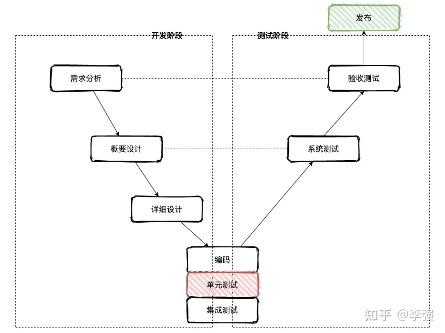
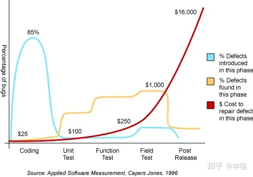
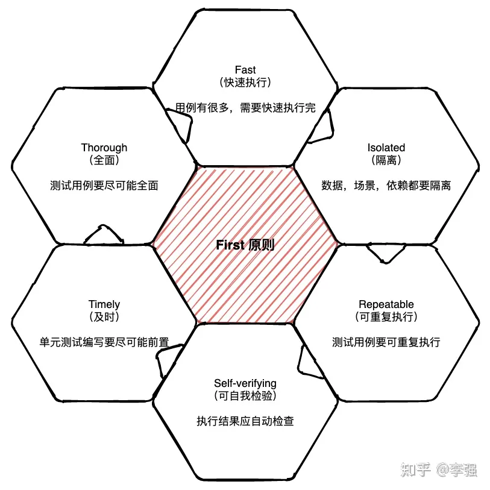
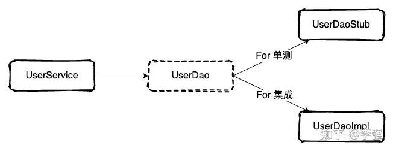
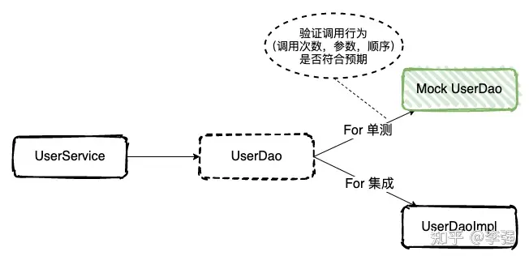
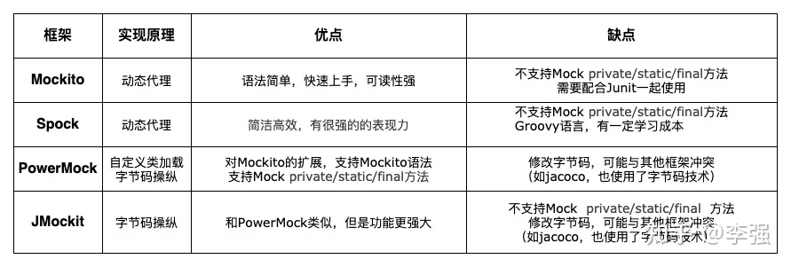

# **认识单测**

## **What**

单元测试是针对程序模块（软件设计的最小单位）来进行正确性检验的测试工作。程序单元是应用的最小可测试部件。

关于测试的名词还有很多，如集成测试，系统测试，验收测试。是在不同阶段，不同角色来共同保证系统质量的一种手段。



笔者在工作中经常遇到一些无效单测，通常是启动Spring容器，连接数据库，调用方法然后控制台输出结果。这些并不能算是单测。示例代码如下：

```java
@RunWith(SpringRunner.class)
@SpringBootTest(classes = ApplicationLoader.class)
public class UserServiceTest {
    @Autowired
    private UserService userService;
    @Test
    public void testAddUser() {
        AddUserRequest addUserRequest = new AddUserRequest("zhangsan", "zhangsan@163.com");
        ResultDTO<Long> addResult = userService.addUser(addUserRequest);
        System.out.println(addResult);
    }
}
```


## **Why**

在工作中很多代码是没有单测的，这些项目也能正常得运行。那么为什么要编写单测呢？

好的单测在能够提供我们代码交付质量的同时，减少bug发现和修复的成本，进而提高工作效率。至于单测能够让QA开心，则只是锦上添花。


**提升工作效率**，在工作中程序员的大多数时间都耗费在了测试阶段，编码往往可能只占一小部分。

尤其是在修改已有代码时候，不得不考虑增量代码是否会对原有逻辑带来冲击，以及修复bug之后是否引入的新的bug。

笔者就曾陷入如此困境，一下午时间都在重复着打包，部署，测试…，在改bug和写bug之间无限循环，有时也会因为一个低级bug抓心挠肝刚到后半夜。

所以长远来看，单测是能够有效提高工作效率的！

**提升代码质量**，可测试通常与软件的设计良好程序相关，难以测试的代码一般设计上都有问题。所以有效的单测会驱动开发者写出更高质量代码。

当然，单测带来最直接的收益就是能够减少bug率，虽然单测不能捕获所有bug，但是的确能够暴露出大多数bug。

**节省成本**，单测能够确保程序的底层逻辑单元的正确性，让问题能够在RD自测阶段暴露出来。bug越早发现，修复成本往往更低，带来的影响也会更小，所以bug应该尽早暴露。

如下图红色曲线所示，在不同阶段修复bug的成本差别是巨大的。




## **Who**

代码的作者最了解代码的目的、特点和实现的局限性。写单测没有比作者更适合的人选了，所以往往代码作者往往是第一责任人。


## **When**

编写单测的时机，一般是 The sooner, the better（越早越好）。尽量不要将单测拖延到代码编写完之后，这样带来的收益可能不尽如人意。


**==TDD（Test-Driven Development）测试驱动开发==**，是一种[软件开发过程](https://link.zhihu.com/?target=https%3A//zh.wikipedia.org/wiki/%E8%BD%AF%E4%BB%B6%E5%BC%80%E5%8F%91%E8%BF%87%E7%A8%8B)中的应用方法，以其倡导先写测试程序，然后编码实现其功能得名。

测试驱动着整个开发过程：首先，驱动代码的设计和功能的实现；其后，驱动代码的再设计和重构。

当然TDD是一种理想的状态，由于种种原因，想要完全遵守TDD原则，是有一定难度的，毕竟PM的需求往往是可变的。

**==边开发边写单测==**，先写少量功能代码，紧接着写单测，重复这两个过程，直到完成功能代码开发。

其实这种方案跟第一种已经很接近，当功能代码开发完时，单测也差不多完成了。这种方案也是最常见和推荐的方式。

**==开发后再补单测==**，效果往往是最差的。首先，要考虑的是代码的可测性，已经完成的代码可能并不具备可测试性，毕竟写代码的时候可以任意发挥。

其次，补单测时容易顺着当前实现去写测试代码，而忽略实际需求的逻辑是什么，导致我们的单测是无效的。


## **Which**

究竟哪些方法需要进行单测？这个困扰笔者很久的一个问题！如上文所说，单测覆盖率当然是越高越好，不过我们在考虑ROI时难免会做出一些妥协。

接受不完美，对于历史代码，全覆盖往往是不现实的。我们可以根据方法优先级（如照成资损，影响业务主流程）针对性补全单测，保证现有逻辑能正常运行。

对于增量代码，笔者认为没有必要全部覆盖，一般根据被测方法**是否有处理（业务）逻辑**来决定。

==比如常见的JavaWeb项目代码中，Controller层，DAO层以及其他仅涉及接口转发相关的方法，往往不需要单测覆盖。而业务逻辑层的各种Service则需要重点测试。==

对于自定义的工具类，正则表达式等固定逻辑，也是必须要测试的。因为这部分逻辑一般都是公共且通用的，一旦逻辑错误会产生比较严重的影响。


## **How**

好的单测一定是能够自动执行并查执行结果的，也不应当对外部有依赖，单测的执行应当是完全自动化，并且无需部署，本地IDE就能运行。

在写单侧前，不妨参考以下前人总结好的First原则。



### F—Fast：快速

在开发过程中通常需要随时执行测试用例；在发布流水线中执行也必须执行，常见的就是push代码后，或者打包时先执行测试用例；况且一个项目中往往有成百上千个测试用例。

所以为了保证开发和发布效率，==快速执行是单测的重要原则。==这就要求我们不要像集成测试一样依赖多个组件，确保单测在秒级甚至毫秒级执行完毕。


### I—Isolated：隔离

隔离性也可以理解为**独立性**，==好的单测是每个测试用例只关注一个逻辑单元或者代码分支，保证单一职责，这样能更清晰的暴露问题和定位问题。==

每个单测之间不应该产生依赖，为了保证单测稳定可靠且便于维护，==单测用例之间决不能互相调用，也不能依赖执行的先后次序。==

数据资源隔离，测试时不要依赖和修改外部数据或文件等其他共享资源，做到测试前后共享资源数据一致。

#### **Fake，Stub和Mock**

我们的被测试代码存在的外部依赖的行为往往是不可预测的，我们需要将这些"变化"变得可控，根据职责不同，可以分为Fake，Stubs，Mock三种。

**假数据（Fake）**, 一些针对当前场景构建的简化版的对象，这些对象作为数据源供我们使用，职责就像内存数据库一样。

比如在常见的三层架构中，业务逻辑层需要依赖数据访问层，当业务逻辑层开发完成后即使数据访问层没有开发完成，也能通过构建Fake数据的方式完成业务逻辑层的测试。

```java
UserDO fakeUser = new UserDO("zhangsan", "zhangsan@163.com");

public UserVO getUser(Long userId) {
  // do something
  User user = fakeUser;  // 测试阶段替换：User user = userDao.getById(userId);
  // do something
}
```

Fake数据虽然可以测试逻辑，但是当数据访问层开发完毕后可能需要修改代码，将Fake数据替换为实际的方法调用来完成代码集成，显然这不是一种优雅的实现，于是便有了Stub。

桩代码（Stub）是用来代替真实代码的临时代码，是在测试环境对依赖接口的一种专门实现。

比如，UserService中调用了UseDao，为了对UserService中的函数进行测试，这时候需要构建一个UserDao接口的实现类UserDaoStub（返回Fake数据），这个临时代码就是所谓的桩代码。



```java
public class UserDaoStub implements UserDao {
    UserDO fakeUser = new UserDO();
    {
        fakeUser.setUserName("zhangsan");
        fakeUser.setEmail("zhangsan@163.com");
        LocalDateTime dateTime = LocalDateTime.of(2021, 7, 1, 12, 30, 0);
        fakeUser.setCreateTime(dateTime);
        fakeUser.setUpdateTime(dateTime);
    }
    @Override
    public UserDO getById(Long id) {
        if (Objects.isNull(id) || id <= 0) {
            return new UserDO();
        }
        return fakeUser;
    }
}
```

这种面向接口编程，使得在不同场景下通过不同的实现类替换接口的编程设计原则就是我们常说的**里氏替换原则**。

Mock 代码和桩代码非常类似，都是用来代替真实代码的临时代码。不同的是在被调用时，会记录被调用信息，执行完毕后验证执行动作或结果是否符合预期。



对于 Mock 代码来说，我们的关注点是 Mock 方法有没有被调用，以什么样的参数被调用，被调用的次数，以及多个 Mock 函数的先后调用顺序。

```java
    @Test
    public void testAddUser4SendEmail() {
        // GIVEN：
        AddUserRequest fakeAddUserRequest = new AddUserRequest("zhangsan", "zhangsan@163.com");
        // WHEN
        ResultDTO<Long> addResult = userService.addUser(fakeAddUserRequest);
        // THEN
        assertTrue(addResult.isSuccess());
        // 验证sendVerifyEmail的调用1次，并且调用参数为我们fake数据中指定的邮箱
        verify(emailService, times(1)).sendVerifyEmail(any());
        verify(emailService).sendVerifyEmail(fakeAddUserRequest.getEmail());
    }
```

当然，我们也可以通过修改Stub的实现，达到和Mock一样的效果。

```java
public class EmailServiceStub implements EmailService{
    public int invokeCount = 0;
    @Override
    public boolean sendVerifyEmail(String email) {
        invokeCount ++;
        // do something
        return true;
    }
}
public class UserServiceImplTest {
    AddUserRequest fakeAddUserRequest;
    private UserServiceImpl userService;
    private EmailServiceStub emailServiceStub;
    @Before
    public void init() {
        fakeAddUserRequest = new AddUserRequest("zhangsan", "zhangsan@163.com");
        emailServiceStub = new EmailServiceStub();
        userService= new UserServiceImpl();
        userService.setEmailService(emailServiceStub);
    }
    @Test
    public void testAddUser4SendEmail() {
        // GIVEN: fakeAddUserRequest
        // WHEN
        ResultDTO<Long> addResult = userService.addUser(fakeAddUserRequest);
        // THEN：发送邮件接口被调用次数是否为1
        Assert.assertEquals(emailServiceStub.invokeCount, 1);
    }
}
```

#### **Stub和Mock的区别**

Stub和Mock的区别在于，**Stub偏向于结果验证，Mock则更加偏向于行为验证。**

比如，测试addUser方法时，如果是Stub方式则关注方法返回结果，即用户是否添加成功，邮件是否发送成功；而Mock方式则倾向于本次添加的行为验证，比如sendEmail方法调用次数等。

#### **Mock替代Stub**

Mock和Stub本质上是不同的，但是随着各种Mock框架的引入，Stub和Mock的边界越来越模糊，使得Mock不仅可以进行行为验证，同样也具备Stub对接口的假实现的能力。

目前大多数的mock工具都提供mock退化为stub的支持，以Mockito为例，我们可以通过anyObject(), any等方式对参数的进行匹配；使用verify方法可以对方法的调用次数和参数进行检验，这和stub就几乎没有本质区别了。

```java
when(userDao.insert(any())).thenReturn(1L);
when(emailService.sendVerifyEmail(anyString())).thenReturn(true);
```

stub理论上也是可以向mock的方向做转化，上文也提及stub是可以通过增加代码来实现一些expectiation的特性，而从使得两者的界限更加的模糊。

所以，如果对于Stub和Mock的概念还是比较模糊，也不必过度纠结，这并不影响写出优秀的单测。


### R—Repeatable：可重复执行

单测是可以重复执行的，不能受到外界环境的影响。 同一测试用例，即使是在不同的机器，不同的环境中运行多次，每次运行都会产生相同的结果。

避免隐式输入（Hidden imput），比如测试代码中不能依赖当前日期，随机数等，否则程序就会变得不可控从而变得不可重复执行。


### S—Self-verifying：自我验证

单测需要通过断言进行结果验证，即当单测执行完毕之后，用来判断执行结果是否和假设一致，无需人工检查是否执行成功。

当然，除了对执行结果进行检查，也能对执行过程进行校验，如方法调用次数等。下面是笔者在工作中经常见到的写法，这些都是无效的单测。

```java
// 直接打印结果
public void testAddUser4DbError() {
    // GIVEN
    fakeAddUserRequest.setUserName("badcase");
    // WHEN
    ResultDTO<Long> addResult = userService.addUser(fakeAddUserRequest);
    // THEN
    System.out.println(addResult);
}
// 吞没异常失败case
public void testAddUser4DbError() {
    // GIVEN
    fakeAddUserRequest.setUserName("badcase");
    // WHEN
      try {
      ResultDTO<Long> addResult = userService.addUser(fakeAddUserRequest);
        // THEN
      Assert.assertTrue(addResult.isSuccess());
    } catch(Exception e) {
        System.out.println("测试执行失败");
    }
}
```

正解如下：

```java
@Test
public void testAddUser4DbError() {
  // GIVEN
  fakeAddUserRequest.setUserName("badcase");
  // WHEN
  ResultDTO<Long> addResult = userService.addUser(fakeAddUserRequest);
  // THEN
  Assert.assertEquals(addResult.getMsg(), "添加用户失败，请稍后重试");
}
```


### T—Timely&Thorough：及时，全面

理想状态当然是TDD模式开发，即测试驱动开发。如前面提到的，编写代码逻辑之前写最佳，边开发边写次之，等代码稳定运行再来补单测收益可能是最低的。

除了及时性，笔者认为T应当有另一层含义，即全面性（Thorough）。理想情况下每行代码都要被覆盖到，每一个逻辑分支都必须有一个测试用例。

不过想要100%的测试覆盖率是非常耗费精力的，甚至会和我们最初提高效率的初衷相悖。所以**花合理的时间抓出大多数bug，要好过穷尽一生抓出所有bug**。

通常情况下我们要至少考虑到参数的边界，特殊值，正常场景(与设计文档结合)以及异常场景，保证我们的核心流程是正确的。


## **Mock框架简介**

工欲善其事必先利其器，选择一个合适的Mock框架与手动实现Stub比，往往能够让我们的单测事半功倍。

需要说明的是，Mock框架并不是必须的。正如上文所说，我们可以实现Stub代码来隔离依赖，当需要使用到Mock对象时，我们只需要对Stub的实现稍作修改即可。

市面上有许多Mock框架可供选择，如常见的Mockito，PowerMock，Spock，EasyMock，JMock等。如何选择合适的框架呢？

如果你想半个小时就能上手，不妨试试Mockito，绝对如丝般顺滑！当然，如果有时间并且对Groovy语言感兴趣，不妨花半天时间了解下Spock，能让测试代码更加精简。

以下是几种常用的Mock框架对比，不知道怎么选时，不妨根据现状，需要注意的是，**大部分Mock框架都不支持Mock静态方法**。




## **单测实战**

写单测一般包括3个部分，即Given（Mock外部依赖&准备Fake数据），When（调用被测方法）以及Then（断言执行结果），这种写法和Spock的语法结构也是一致的。

为了更好的理解单元测试，笔者将针对如下代码，分别使用Mockito和Spock写一个简单的示例，让大家感受一下两者的各自的特点和不同。

```java
@Service
@AllArgsConstructor
@NoArgsConstructor
public class UserServiceImpl implements UserService {

    @Autowired
    private UserDao userDao;

    @Autowired
    private EmailService emailService;

    public ResultDTO<Long> addUser(AddUserRequest request) {
        // 1. 校验参数
        ResultDTO<Void> validateResult = validateAddUserParam(request);
        if (!validateResult.isSuccess()) {
            return ResultDTO.paramError(validateResult.getMsg());
        }

        // 2. 添加用户
        UserDO userDO = request.buildUserDO();
        long id = userDao.insert(userDO);

        // 3. 添加成功，返回验证激活邮件
        if (id > 0) {
            emailService.sendVerifyEmail(request.getEmail());
            return ResultDTO.success(id);
        }
        return ResultDTO.internalError("添加用户失败，请稍后重试");
    }

    /**
     * 校验添加用户参数
     */
    private ResultDTO<Void> validateAddUserParam(AddUserRequest request) {
        if (Objects.isNull(request)) {
            return ResultDTO.paramError("添加用户参数不能为空");
        }
        if (StringUtils.isBlank(request.getUserName())) {
            return ResultDTO.paramError("用户名不能为空");
        }
        if (!EmailValidator.validate(request.getEmail())) {
            return ResultDTO.paramError("邮箱格式错误");
        }
        return ResultDTO.success();
    }
}
```

基于Mockito的单测示例如下，需要注意的下面是纯java代码，没有对象显示调用的方法都是已经静态导入过的。

```java
@RunWith(MockitoJUnitRunner.class)
public class UserServiceImplTest {
    // Fake：需要提前构造的假数据
    AddUserRequest fakeAddUserRequest;

    // Mock: mock外部依赖
    @InjectMocks
    private UserServiceImpl userService;
    @Mock
    private UserDao userDao;
    @Mock
    private EmailService emailService;

    @Before
    public void init() {
        fakeAddUserRequest = new AddUserRequest("zhangsan", "zhangsan@163.com");
        when(userDao.insert(any())).thenReturn(1L);
        when(emailService.sendVerifyEmail(anyString())).thenReturn(true);
    }

    @Test
    public void testAddUser4NullParam() {
        // GIVEN
        fakeAddUserRequest = null;
        // WHEN
        ResultDTO<Long> addResult = userService.addUser(fakeAddUserRequest);
        // THEN
        assertEquals(addResult.getMsg(), "添加用户参数不能为空");
    }
    @Test
    public void testAddUser4BadEmail() {
        // GIVEN
        fakeAddUserRequest.setEmail(null);
        // WHEN
        ResultDTO<Long> addResult = userService.addUser(fakeAddUserRequest);
        // THEN
        assertEquals(addResult.getMsg(), "邮箱格式错误");
    }
    @Test
    public void testAddUser4BadUserName() {
        // GIVEN
        fakeAddUserRequest.setUserName(null);
        // WHEN
        ResultDTO<Long> addResult = userService.addUser(fakeAddUserRequest);
        // THEN
        assertEquals(addResult.getMsg(), "用户名不能为空");
    }

    @Test
    public void testAddUser4DbError() {
        // GIVEN
        when(userDao.insert(any())).thenReturn(-1L);
        // WHEN
        ResultDTO<Long> addResult = userService.addUser(fakeAddUserRequest);
        // THEN
        assertEquals(addResult.getMsg(), "添加用户失败，请善后重试");
    }

    @Test
    public void testAddUser4SendEmail() {
        // GIVEN
        // WHEN
        ResultDTO<Long> addResult = userService.addUser(fakeAddUserRequest);
        // THEN
        assertTrue(addResult.isSuccess());
        verify(emailService, times(1)).sendVerifyEmail(any());
        verify(emailService).sendVerifyEmail(fakeAddUserRequest.getEmail());
    }

}
```

正如上文提到的，Spock能够让代码更加精简，尤其是在代码逻辑分支比较多的场景下。下面是基于Spock的单测。

```java
class UserServiceImplSpec extends Specification {
    UserServiceImpl userService = new UserServiceImpl();
    AddUserRequest fakeAddUserRequest;
    def userDao = Mock(UserDao)
    def emailService = Mock(EmailService)

    def setup() {
        // Fake数据创建
        fakeAddUserRequest = new AddUserRequest(userName: "zhangsan", email: "zhangsan@163.com")
        // 注入Mock对象
        userService.userDao = userDao
        userService.emailService = emailService
    }

    def "testAddUser4BadParam"() {
        given:
        if (Objects.isNull(userName) || Objects.is(email)) {
            fakeAddUserRequest = null
        } else {
            fakeAddUserRequest.setUserName(userName)
            fakeAddUserRequest.setEmail(email)
        }
        when:
        def result = userService.addUser(fakeAddUserRequest)
        then:
        Objects.equals(result.getMsg(), resultMsg)
        where:
        userName   | email              | resultMsg
        null       | null               | "添加用户参数不能为空"
        "Java填坑笔记" | null               | "邮箱格式错误"
        null       | "javaTKBJ@163.com" | "用户名不能为空"
    }

    def "testAddUser4DbError"() {
        given:
        _ * userDao.insert(_) >> -1L
        when:
        def result = userService.addUser(fakeAddUserRequest)
        then:
        Objects.equals(result.getMsg(), "添加用户失败，请稍后重试")
    }

    def "testAddUser4SendEmail"() {
        given:
        _ * userDao.insert() >> 1
        when:
        def result = userService.addUser(fakeAddUserRequest)
        then:
        result.isSuccess()
        1 * emailService.sendVerifyEmail(fakeAddUserRequest.getEmail())
    }
}
```


## **思考总结**

在验证商业模式之前，时刻要想考虑投入产出比。时间和商业成本太高不利于产品快速推向市场，所以什么时候推广单测，需要更高阶的人决策。

测试不可能序错误，单测也不例外。单测只测试程序单元自身的功能。因此，它不能发现集成错误、性能、或者其他系统级别的问题。

单测能够提高代码质量，驱动代码设计，帮助我们更早发现问题，保障持续优化和重构，是工程师的一项必备技能。