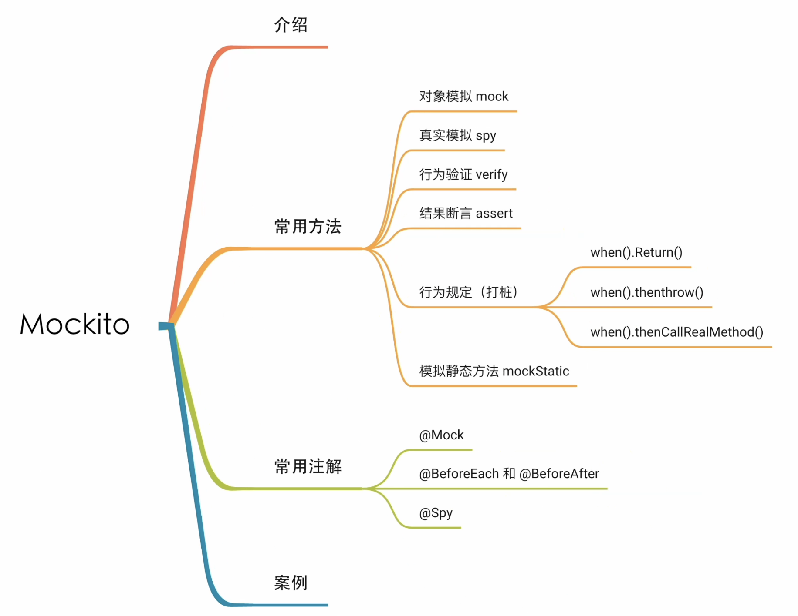

# Mockito

[TOC]



## 1. 为什么要使用 mock

Mock 可以理解为创建一个虚假的对象，或者说模拟出一个对象，在测试环境中用来替换掉真实的对象，以达到我们可以：

- 验证该对象的某些方法的调用情况，调用了多少次，参数是多少
- 给这个对象的行为做一个定义，来指定返回结果或者指定特定的动作


## 2. Mockito 中常用方法

### 2.1 Mock 方法

mock 方法来自 `org.mockito.Mock`，它表示可以 mock 一个对象或者是接口。

```java
public static <T> T mock(Class<T> classToMock)
```

- classToMock：待 mock 对象的 class 类。
- 返回 mock 出来的类

实例：使用 mock 方法 mock 一个类

```java
Random random = Mockito.mock(Random.class);
```

整行代码的意义是，你告诉`Mockito`创建一个`Random`类的模拟版本，并将这个模拟版本赋值给变量`random`。这样，当你在测试中使用这个`random`对象时，==它不会执行`Random`类的实际逻辑，而是按照你通过Mockito框架设置的行为来响应，==如返回预设的随机数，而不是真正的随机数。

此外，也可以使用 `@Mock` 替代这里的Mock方法：

````java
@Mock
private Random random;
````


### 2.2 对 Mock 出来的对象进行行为验证和结果断言

验证是校验待验证的对象是否发生过某些行为，Mockito 中验证的方法是：verify。

```java
verify(mock).someMethod("some arg");
verify(mock, times(1)).someMethod("some arg");
```

使用 verify 验证：

Verify 配合 time() 方法，可以校验某些操作发生的次数。

```java
@Test
void check() {
    Random random = Mockito.mock(Random.class, "test"); //用"test"（测试）这个名称来标识它。如果涉及这个模拟的测试失败了，名称"test"将出现在输出中，使得很容易识别出参与的就是这个特定的模拟对象。
    System.out.println(random.nextInt());
    Mockito.verify(random,Mockito.times(2)).nextInt();
}
```

断言使用到的类是 Assertions.

```
Random random = Mockito.mock(Random.class, "test");
Assertions.assertEquals(100, random.nextInt());
```

输出结果：

```java
org.opentest4j.AssertionFailedError: 
Expected :100
Actual   :0
```

==***当使用 mock 对象时，如果不对其行为进行定义，则 mock 对象方法的返回值为返回类型的默认值。***==


### 2.3 给 Mock 对象打桩

打桩可以理解为 mock 对象规定一行的行为，使其按照我们的要求来执行具体的操作。在 Mockito 中，常用的打桩方法为

| 方法                                | 含义                                                         |
| ----------------------------------- | ------------------------------------------------------------ |
| when().thenReturn()                 | Mock 对象在触发指定行为后返回指定值                          |
| when().thenThrow()                  | Mock 对象在触发指定行为后抛出指定异常                        |
| when().doCallRealMethod()           | Mock 对象在触发指定行为后调用真实的方法                      |
| when().thenAnswer(Answer<?> answer) | 当触发特定方法时返回一个动态值，根据 `Answer` 接口的实现来决定。 |

thenReturn() 代码示例

```java
@Test
void check() {
    Random random = Mockito.mock(Random.class, "test");
    Mockito.when(random.nextInt()).thenReturn(100);
    Assertions.assertEquals(100, random.nextInt()); //断言比较测试
}
```

```java
测试通过
```


### 2.4 Mock 静态方法

首先要引入 Mockito-Inline 的依赖。

```
<dependency>
    <groupId>org.mockito</groupId>
    <artifactId>mockito-inline</artifactId>
    <version>4.3.1</version>
    <scope>test</scope>
</dependency>
```

使用 `mockStatic()` 方法来 mock静态方法的所属类，此方法返回一个具有作用域的模拟对象。

```java
@Test
void range() {
    MockedStatic<StaticUtils> utilities = Mockito.mockStatic(StaticUtils.class);
    utilities.when(() -> StaticUtils.range(2, 6)).thenReturn(Arrays.asList(10, 11, 12));
    Assertions.assertTrue(StaticUtils.range(2, 6).contains(10));
}
```

```java
@Test
void name() {
    MockedStatic<StaticUtils> utilities = Mockito.mockStatic(StaticUtils.class);
    utilities.when(StaticUtils::name).thenReturn("bilibili");
    Assertions.assertEquals("1", StaticUtils.	name());
}
```

执行整个测试类后会报错：

```java
org.mockito.exceptions.base.MockitoException: 
For com.echo.mockito.Util.StaticUtils, static mocking is already registered in the current thread

To create a new mock, the existing static mock registration must be deregistered
```

**原因是因为 mockStatic() 方法是将当前需要 mock 的类注册到本地线程上（ThreadLocal），而这个注册在一次 mock 使用完之后是不会消失的，需要我们手动的去销毁。如过没有销毁，再次 mock 这个类的时候 Mockito 将会提示我们 ：”当前对象 mock 的对象已经在线程中注册了，请先撤销注册后再试“。这样做的目的也是为了保证模拟出来的对象之间是相互隔离的，保证同时和连续的测试不会收到上下文的影响。**

因此我们修改代码：

```java
class StaticUtilsTest {

    @Test
    void range() {
        try (MockedStatic<StaticUtils> utilities = Mockito.mockStatic(StaticUtils.class)) {
            utilities.when(() -> StaticUtils.range(2, 6)).thenReturn(Arrays.asList(10, 11, 12));
            Assertions.assertTrue(StaticUtils.range(2, 6).contains(10));
        }

    }

    @Test
    void name() {
        try (MockedStatic<StaticUtils> utilities = Mockito.mockStatic(StaticUtils.class)) {
            utilities.when(StaticUtils::name).thenReturn("bilibili");
            Assertions.assertEquals("bilibili", StaticUtils.name());
        }
    }
}
```


## 3. Mockito 中常用注解

### 3.1 可以代替 Mock 方法的 @Mock 注解

> Shorthand for mocks creation - @Mock annotation
>
> **Important!** This needs to be somewhere in the base class or a test runner:

快速 mock 的方法，使用 `@mock` 注解。

==***mock 注解需要搭配 MockitoAnnotations.openMocks(testClass) 方法一起使用。***==

```java
@Mock
private Random random;

@Test
void check() {
    MockitoAnnotations.openMocks(this);
    Mockito.when(random.nextInt()).thenReturn(100);
    Assertions.assertEquals(100, random.nextInt());
}
```


### 3.2 @BeforeEach 与 @AfterEach 注解

```java
@Mock
private Random random;

@BeforeEach
void setUp() {
    System.out.println("----测试开始----");
}

@Test
void check() {
    MockitoAnnotations.openMocks(this);
    Mockito.when(random.nextInt()).thenReturn(100);
    Assertions.assertEquals(100, random.nextInt());
}

@AfterEach
void after() {
    System.out.println("----测试结束----");
}
```

而在 Junit5 中，@Before 和 @After 注解被 `@BeforeEach` 和 `@AfterEach` 所替代。


### 3.3 Spy 方法与 @Spy 注解

spy() 方法与 mock() 方法不同的是

1. ==被 spy 的对象会走真实的方法，而 mock 对象不会==
2. ==spy() 方法的参数是对象实例，mock 的参数是 class==

***示例：spy 方法与 Mock 方法的对比***

```java
@Test
void check() {
    CheckAuthorityImpl checkAuthority = Mockito.spy(new CheckAuthorityImpl());
    int res = checkAuthority.add(1, 2);
    Assertions.assertEquals(3, res);

    CheckAuthorityImpl checkAuthority1 = Mockito.mock(CheckAuthorityImpl.class);
    int res1 = checkAuthority1.add(1, 2);
    Assertions.assertEquals(3, res1);
 }
```

输出结果

```java
// 第二个 Assertions 断言失败，因为没有给 checkAuthority1 对象打桩，因此返回默认值
org.opentest4j.AssertionFailedError: 
Expected :3
Actual   :0
```

使用 `@Spy` 注解代码示例

```java
@Spy
private CheckAuthorityImpl checkAuthority;

@BeforeEach
void setUp() {
    MockitoAnnotations.openMocks(this);
}

@Test
void check() {
    int res = checkAuthority.add(1, 2);
    Assertions.assertEquals(3, res);
}
```


